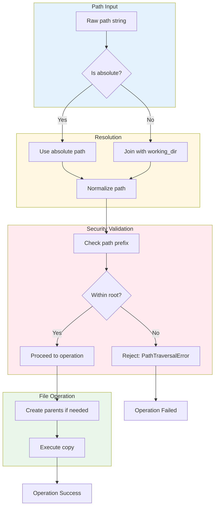

# Path Traversal Security

### From: copy_file

Path traversal security is a critical defensive programming concept that prevents attackers from accessing files outside intended directories by manipulating file paths containing special sequences like `..` (parent directory). CopyFileTool implements path traversal protection through its `check_path_within_root` validation, which ensures both source and destination paths remain strictly within the designated working directory. This defense is essential when tools execute on behalf of potentially malicious or compromised agents that might attempt to read sensitive files (`/etc/passwd`) or write to system locations. The validation occurs after path resolution but before any file system operations, establishing a security boundary.

The implementation strategy in CopyFileTool employs canonicalization-based verification. After resolving paths against the working directory (handling both absolute paths and relative joins), the code validates that the resulting path is prefixed by the working directory path. This approach correctly handles various edge cases: multiple consecutive separators, `.` components, `..` sequences that would escape the root, and symbolic links that might redirect outside the sandbox. The `resolve_path` helper function ensures consistent path resolution before validation, normalizing relative paths through `PathBuf::join` while preserving absolute paths as-is. This two-phase approach (resolution then validation) prevents TOCTOU (time-of-check to time-of-use) vulnerabilities in the validation itself.

Path traversal defenses must be considered within broader security architecture. CopyFileTool's "file:write" permission category enables coarse-grained access control at the system level, while path validation provides fine-grained enforcement. Additional layers like chroot jails, containerization, or Linux namespaces could provide defense in depth. The tool's design acknowledges that path validation alone cannot prevent all attacks—symbolic link following, race conditions in directory creation, and procfs-based attacks require additional mitigations. The metadata in ToolOutput (recording actual resolved paths) supports audit logging for forensic analysis of attempted or successful operations. These layered defenses exemplify secure by design principles appropriate for agent-based systems where code execution boundaries may be permeable.

## Diagram

## External Resources

- [OWASP Path Traversal attack documentation](https://owasp.org/www-community/attacks/Path_Traversal) - OWASP Path Traversal attack documentation
- [Rust PathBuf documentation for path manipulation](https://doc.rust-lang.org/std/path/struct.PathBuf.html) - Rust PathBuf documentation for path manipulation
- [CWE-22: Improper Limitation of a Pathname to a Restricted Directory](https://cwe.mitre.org/data/definitions/22.html) - CWE-22: Improper Limitation of a Pathname to a Restricted Directory

## Sources

- [copy_file](../sources/copy-file.md)
