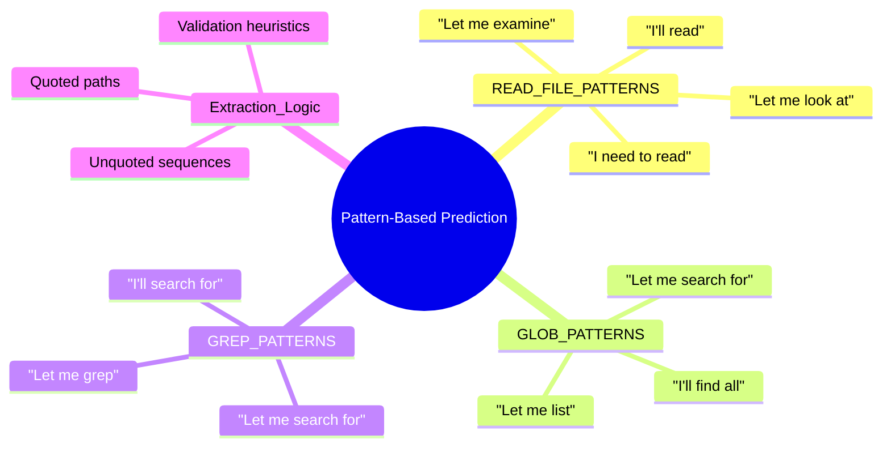

# Pattern-Based Prediction

### From: predictive

Pattern-based prediction in this module implements a lightweight, interpretable approach to intent classification using curated string patterns rather than machine learning models. The system maintains three constant arrays—`READ_FILE_PATTERNS`, `GLOB_PATTERNS`, and `GREP_PATTERNS`—containing natural language phrases that reliably precede specific tool invocations. These patterns capture common LLM conversational habits, such as prefacing file reads with "I'll read" or "Let me examine", reflecting the training distribution of popular instruction-tuned models. The pattern matching employs case-insensitive containment checks, providing robustness to capitalization variations while maintaining simplicity and predictability.

The strength of this approach lies in its interpretability and debuggability: developers can directly inspect and modify the pattern sets to improve prediction accuracy for specific models or domains. The confidence scoring system, while currently using fixed values per pattern category, provides hooks for more nuanced probability estimation. The extraction logic that follows pattern matching demonstrates sophisticated string processing, handling both quoted paths (e.g., "src/main.rs") and unquoted sequences through state machine-like character iteration. The `looks_like_file_path` validation applies simple heuristics—requiring dots or slashes—to filter false positives from pattern matches, reducing wasted pre-fetch operations.

This technique occupies a pragmatic middle ground between naive keyword matching and complex neural classification, providing good accuracy with minimal computational overhead. The approach is particularly well-suited to the domain where LLM outputs follow predictable templates for tool-calling, a pattern encouraged by system prompts and few-shot examples in agent frameworks. Future evolution could incorporate learned patterns from conversation logs, weighted pattern scoring based on historical accuracy, or hybrid approaches where pattern matching triggers lightweight classifier verification. The module's structure, with pattern constants clearly separated from extraction logic, supports such evolution while maintaining the core simplicity that enables rapid iteration and debugging.

## Diagram

## External Resources

- [Wikipedia article on pattern matching in computer science](https://en.wikipedia.org/wiki/Pattern_matching) - Wikipedia article on pattern matching in computer science
- [Rust regex crate for more sophisticated pattern matching](https://docs.rs/regex/latest/regex/) - Rust regex crate for more sophisticated pattern matching

## Related

- [Token Streaming Analysis](token-streaming-analysis.md)
- [Speculative Execution in LLM Applications](speculative-execution-in-llm-applications.md)

## Sources

- [predictive](../sources/predictive.md)
