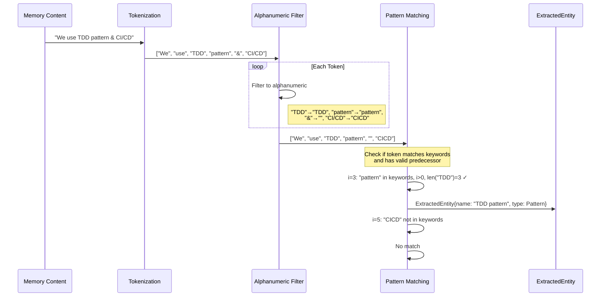

# Pattern Matching Heuristics

### From: knowledge_graph

The pattern matching subsystem implements lightweight linguistic analysis for extracting compound concept expressions through proximity-based keyword detection. The extract_pattern_entities function processes tokenized content to identify sequences where specific pattern-indicating keywords follow meaningful content words, capturing expressions like "TDD pattern", "microservices architecture", or "agile methodology". This approach leverages regularity in how developers describe conventions—typically as "[Adjective/Noun] [Keyword]" constructions where the keyword disambiguates the preceding term's semantic category.

The implementation applies careful preprocessing to handle punctuation and special characters that would otherwise fragment tokenization, filtering each token to retain only alphanumeric characters before analysis. This normalization ensures robust matching against varied text formatting while potentially over-normalizing in cases where special characters carry semantic significance. The keyword list encompasses five pattern-indicating terms—pattern, convention, approach, methodology, paradigm—providing broad coverage of convention-description vocabulary with manageable complexity.

The positional requirement that keywords must follow a preceding token of at least three characters eliminates false positives from sentence-initial keywords and single-letter artifacts, though this heuristic may exclude valid short-form patterns like "Go convention" or "C pattern". The extracted patterns preserve original casing and spacing from source text, maintaining natural readability while associating the compound expression with EntityType::Pattern for knowledge graph integration. This extraction mechanism complements dictionary-based approaches by capturing domain-specific and emergent conventions without requiring exhaustive enumeration.

## Diagram

## External Resources

- [Heuristic methods in computer science](https://en.wikipedia.org/wiki/Heuristic) - Heuristic methods in computer science
- [Tokenization in lexical analysis](https://en.wikipedia.org/wiki/Tokenization_(lexical_analysis)) - Tokenization in lexical analysis

## Related

- [Entity Extraction](entity-extraction.md)

## Sources

- [knowledge_graph](../sources/knowledge-graph.md)
