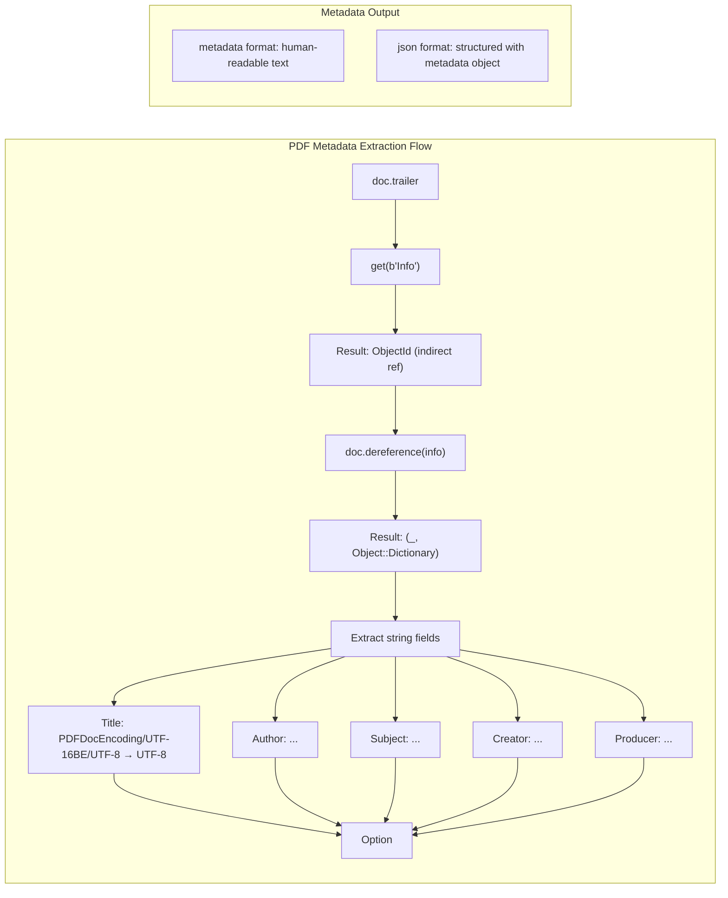

# PDF Metadata Extraction

### From: pdf_read

PDF metadata extraction involves retrieving document properties embedded in the PDF Info dictionary, a task that requires navigating the PDF object model to locate and decode standardized information fields. This implementation demonstrates the technical approach through `extract_metadata`, which traverses from the document trailer through indirect references to reach the Info dictionary, then extracts string values for common document properties. The metadata fields—Title, Author, Subject, Creator, and Producer—represent a de facto standard for document description that originated in PDF's early development and persists despite the format's evolution toward XMP-based metadata in more recent specifications.

The implementation's navigation of PDF internals for metadata extraction reveals the indirect reference pattern fundamental to PDF architecture. Documents use a trailer dictionary containing an Info key whose value is an indirect reference (object number and generation) rather than the dictionary itself. The code must dereference this indirect object through `doc.dereference`, handling potential failures at each step, to reach the actual Info dictionary. Once obtained, string values in PDF may use various encodings (PDFDocEncoding, UTF-16BE with BOM, or UTF-8), requiring conversion through `String::from_utf8_lossy` which handles invalid sequences gracefully by producing the Unicode replacement character rather than failing entirely.

The selective extraction of these five fields reflects practical priorities in document processing systems. Title and Author support document identification and attribution; Subject enables content categorization; Creator and Producer reveal document generation tools (distinguishing, for example, between documents created in Microsoft Word and those distilled through Adobe Acrobat). The implementation's use of `Option<String>` for all fields acknowledges that PDF documents frequently lack complete metadata, particularly those generated by simple tools or through printing workflows. The metadata-only output format ('metadata') provides agent systems with efficient document profiling capability without requiring full text extraction, supporting use cases like duplicate detection, source attribution, and preliminary relevance filtering in document-intensive workflows.

## Diagram

## External Resources

- [XMP Specification Part 1 - Adobe's Extensible Metadata Platform](https://www.adobe.com/content/dam/acom/en/devnet/xmp/pdfs/XMPSpecificationPart1.pdf) - XMP Specification Part 1 - Adobe's Extensible Metadata Platform
- [ExifTool PDF tag reference - comprehensive metadata field documentation](https://exiftool.org/TagNames/PDF.html) - ExifTool PDF tag reference - comprehensive metadata field documentation

## Sources

- [pdf_read](../sources/pdf-read.md)
