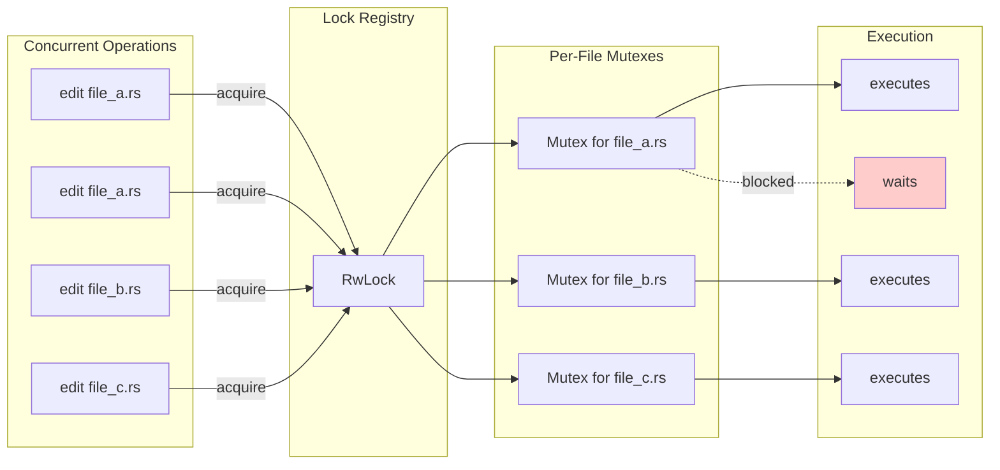

# Per-File Locking

### From: file_lock

Per-file locking is a concurrency control pattern that provides mutual exclusion at the granularity of individual files rather than global locks that would serialize all operations. This approach enables high parallelism in systems that manipulate multiple files concurrently while still ensuring safety when the same file is accessed by multiple concurrent operations. The fundamental insight is that conflicting operations only occur when the same resource (file) is involved, so locks should be scoped to that resource.

The implementation in this file demonstrates several sophisticated aspects of per-file locking. First, it uses a registry pattern where locks are created on-demand and cached for reuse, avoiding the overhead of repeated lock creation for frequently accessed files. Second, it canonicalizes paths before lookup, ensuring that different path representations of the same file (e.g., `./file.txt`, `/home/user/file.txt`, symlinks) map to the same lock. Third, the reference-counted `Arc<Mutex<()>>` design allows multiple concurrent operations to wait on the same lock while the registry itself remains protected by a readers-writer lock for efficient lookups.

This pattern is particularly valuable in build systems, IDEs, version control tools, and agent systems where multiple operations may target overlapping file sets. Without per-file locking, systems must choose between coarse global locking (limiting parallelism) or complex conflict detection and rollback mechanisms. The per-file approach provides an elegant middle ground with strong safety guarantees and minimal coordination overhead for non-conflicting operations.

## Diagram

## External Resources

- [Wikipedia article on file locking mechanisms](https://en.wikipedia.org/wiki/File_locking) - Wikipedia article on file locking mechanisms
- [Rust standard library Mutex documentation](https://doc.rust-lang.org/std/sync/struct.Mutex.html) - Rust standard library Mutex documentation

## Related

- [Canonical Path Resolution](canonical-path-resolution.md)

## Sources

- [file_lock](../sources/file-lock.md)
