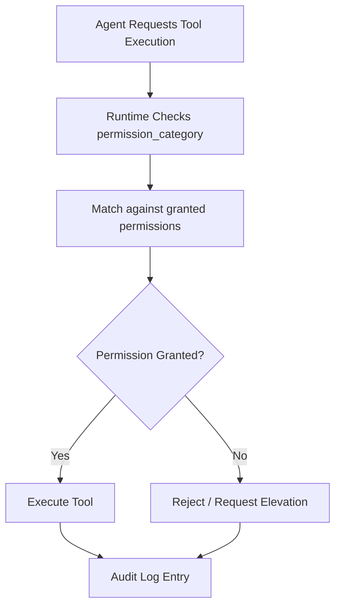

# Permission-Based Access Control

### From: bash_reset

Permission-based access control in ragent-core implements a category-based security model where tools declare their sensitivity and capability requirements through static string identifiers. The `permission_category` method in `BashResetTool` returns `"bash:execute"`, a hierarchical identifier suggesting both the functional domain (bash operations) and the specific capability (execution). This declaration enables the agent runtime to enforce authorization policies, audit tool usage, and potentially request user confirmation for sensitive operations.

The categorization system reflects a defense-in-depth strategy for agent security, recognizing that autonomous AI systems with tool access represent significant attack surfaces if unrestricted. By requiring explicit permission declarations, the framework enables operators to construct principle-of-least-privilege configurations where agents possess only the capabilities necessary for their assigned tasks. A document-processing agent might be granted file read permissions but denied bash execution; a code analysis agent might receive read-only filesystem access but not write capabilities.

The specific category `"bash:execute"` implies a broader taxonomy of bash-related permissions that might include distinctions between execution, state modification, environment changes, or network access through shell tools. The reset tool's inclusion in the execute category rather than a hypothetical "bash:state" category suggests either that state modification is considered an execution-level capability, or that the permission taxonomy prioritizes the broader functional area over specific operation types. This categorization enables coarse-grained policy enforcement while maintaining extensibility for finer-grained controls as the framework evolves.

## Diagram

## External Resources

- [OWASP security principles relevant to automated system permissions](https://owasp.org/www-project-top-ten/) - OWASP security principles relevant to automated system permissions
- [Principle of least privilege in access control design](https://en.wikipedia.org/wiki/Principle_of_least_privilege) - Principle of least privilege in access control design

## Sources

- [bash_reset](../sources/bash-reset.md)

### From: github_issues

Permission-based access control in this codebase categorizes tool operations by their security impact and required authorization levels, enabling fine-grained policy enforcement for agent actions. The permission_category() method returns string identifiers like "github:read" for information-retrieval operations and "github:write" for mutation operations including issue creation, commenting, and closure. This categorization scheme supports sophisticated authorization models where different agent identities, user roles, or execution contexts can be granted different capability sets. The colon-delimited namespace convention suggests extensibility to other service categories beyond GitHub, enabling unified permission management across diverse tool ecosystems.

The security architecture enabled by this pattern addresses critical concerns in autonomous agent systems. Unrestricted agent capabilities could lead to accidental or malicious data loss, unauthorized code modifications, or resource exhaustion attacks. By explicitly declaring permission requirements, the system can implement defense-in-depth: requiring user confirmation for write operations, logging sensitive actions for audit trails, rate-limiting expensive operations, or completely disabling high-risk tools in restricted environments. The read/write distinction mirrors familiar database permission models and REST API design patterns, making the security model intuitive for developers. The implementation's separation of read and write categories across its five tools demonstrates consistent application of the principle of least privilege.

Operational implications of this permission model include support for gradual capability rollouts, where new agents start with read-only access and earn write permissions through verified behaviors or human approval workflows. The string-based category system allows policy evolution without code changes—new permission levels can be introduced, and authorization middleware can implement complex rules based on category prefixes or suffixes. Integration with external identity providers, OAuth scopes, or policy-as-code systems becomes straightforward when tools self-declare their requirements. This pattern represents a foundational security mechanism for trustworthy AI agent deployment, balancing capability richness with appropriate safeguards against misuse.

### From: gitlab_mrs

Permission-based access control is a security architecture pattern that categorizes operations into capability groups, enabling fine-grained authorization decisions for AI agents and automated systems. In this GitLab tools implementation, the permission_category method on each tool returns a string like "gitlab:read" or "gitlab:write", establishing a namespace-prefixed hierarchy that clearly separates observation from mutation. This design follows the principle of least privilege by allowing system administrators to grant agents only the specific capabilities required for their tasks, rather than blanket repository access. The colon-separated format enables hierarchical permissions where "gitlab:write" might implicitly include "gitlab:read", or where wildcard patterns like "gitlab:*" could grant all GitLab operations while excluding other service categories.

The read/write distinction implemented here—where listing and getting MRs are read operations while creating, merging, and approving are write operations—mirrors traditional database permission models and HTTP method semantics (GET vs POST/PUT). This alignment with familiar patterns reduces cognitive load for developers configuring agent permissions. The categorization also supports audit logging and compliance requirements; every tool execution can be logged with its permission category, creating an immutable trail of what capabilities were exercised when. For high-stakes operations like merging code, the "gitlab:write" category might trigger additional approval workflows or require human-in-the-loop confirmation even when the agent has the technical capability.

Runtime enforcement of these permissions occurs outside the individual tools, likely in a middleware layer that inspects the Tool trait implementation before execution. This separation of concerns keeps tool implementations focused on business logic while security policy remains configurable and auditable. The pattern extends naturally to multi-tenant scenarios where different agents or users might have varying GitLab access levels—one agent might only read MRs for reporting, another might create draft MRs for automated refactoring, and a privileged agent could execute merges after comprehensive validation. This granular permission model is essential for production AI deployments where unconstrained tool access would create unacceptable security and operational risks.

### From: list_tasks

Permission-based access control is a security architecture pattern that categorizes system capabilities into hierarchical permission domains, enabling centralized authorization decisions for operations with similar security implications. The ListTasksTool implementation demonstrates this pattern through its permission_category method returning "agent:spawn", indicating that task listing capabilities are grouped with agent spawning permissions under a unified security classification. This design choice reflects security analysis that task introspection and task creation share similar privilege requirements—both reveal information about or enable control over agent execution infrastructure. The pattern enables coarse-grained access control policies where administrators can grant or revoke entire capability domains rather than individual tools, reducing policy complexity while maintaining security boundaries appropriate for the underlying operations.

The technical implementation reveals architectural decisions about the granularity of security primitives in agent systems. The string-based permission category (rather than fine-grained capability tokens) suggests a model optimized for human-administered policies where simplicity and auditability outweigh the flexibility of capability-based security. This approach aligns with common patterns in cloud-native authorization systems like Kubernetes RBAC or AWS IAM, where resource-type groupings enable manageable policy scale. The "agent:" prefix establishes a namespace convention that organizes permissions by functional domain, suggesting extensibility to additional agent-related permissions (agent:delete, agent:modify, agent:admin) without naming collisions. The permission check integration point—presumably in the ToolContext or orchestration layer preceding execute invocation—enables consistent enforcement across all Tool implementations without per-tool security logic duplication.

This permission model addresses critical security challenges in AI agent systems where autonomous code execution creates elevated risk profiles compared to traditional applications. The grouping of list_tasks with spawn permissions prevents information leakage scenarios where low-privilege users could enumerate running agents to identify targets for other attacks, recognizing that observability itself can be a security-sensitive capability. The pattern supports defense-in-depth through layered authorization where permission checks complement input validation, rate limiting, and resource quotas. The design enables multi-tenant deployments where session isolation (enforced through session_id filtering) combines with permission boundaries to prevent cross-tenant data access. This security architecture reflects lessons from multi-user operating systems and container orchestration platforms adapted to the specific threat models of autonomous agent execution, where the ability to observe agent activity may reveal intellectual property, user data, or system configuration information requiring protection.
