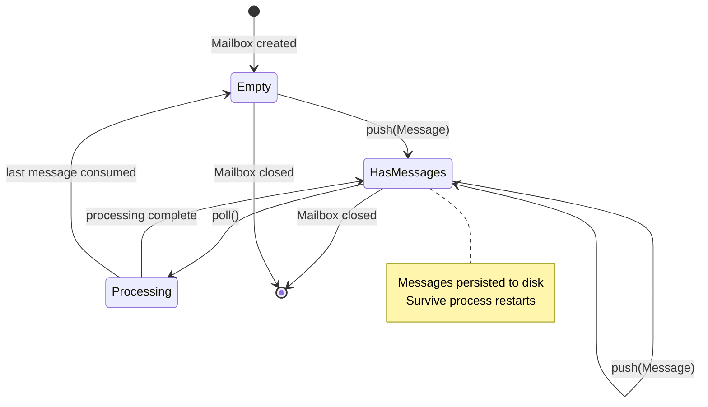

# Persistent Actor Mailboxes

### From: team_approve_plan

Persistent actor mailboxes implement the actor model's message passing with durable storage guarantees, ensuring message delivery despite process crashes or extended recipient unavailability. The Mailbox abstraction in this codebase provides file-backed persistence where messages survive process restarts, enabling asynchronous communication between decoupled components without requiring simultaneous availability. This pattern bridges the gap between ephemeral in-memory message queues and heavyweight message brokers like RabbitMQ or Kafka.

The design choices reflect edge case handling learned from production distributed systems: messages are pushed atomically to prevent partial writes, directories are scoped by team to enable access control and isolation, and agent-specific mailbox instances prevent cross-tenant message leakage. The lack of explicit acknowledgement mechanisms suggests at-least-once delivery semantics with idempotent message processing as the reliability strategy. This is appropriate for workflow notifications where duplicate delivery is harmless but message loss would stall progress.

The mailbox pattern enables temporal decoupling between tool execution and teammate processing, critical for systems where agents run on different schedules or resources. A team lead might approve a plan during business hours while the teammate agent processes the notification during its next scheduled execution window. The persistent storage also supports audit requirements, providing immutable records of all coordination decisions for compliance and debugging. The simplicity of the push-only API suggests consumers implement their own polling or notification mechanisms, maintaining flexibility for different deployment environments.

## Diagram

## External Resources

- [Actor model of concurrent computation](https://en.wikipedia.org/wiki/Actor_model) - Actor model of concurrent computation
- [Akka mailbox documentation for actor messaging](https://doc.akka.io/docs/akka/current/typed/mailboxes.html) - Akka mailbox documentation for actor messaging
- [Message persistence patterns](https://en.wikipedia.org/wiki/Message_persistence) - Message persistence patterns

## Related

- [Event-Driven Architecture](event-driven-architecture.md)

## Sources

- [team_approve_plan](../sources/team-approve-plan.md)
