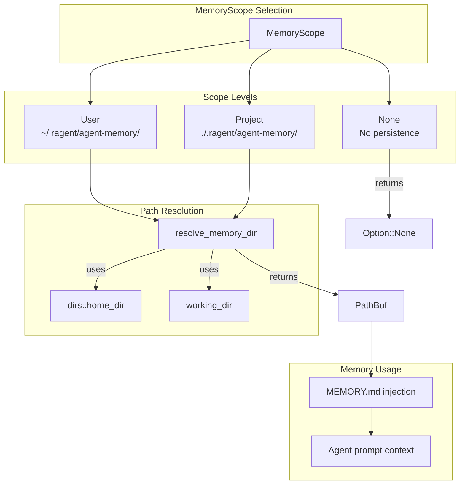

# Persistent Memory Scope

### From: config

Persistent memory scope is a configuration concept that determines how and where AI agents maintain contextual information across sessions. In ragent, this is implemented through the `MemoryScope` enum with three distinct levels: `None` for stateless operation, `User` for global persistence across all projects, and `Project` for localized context within a specific codebase. This tiered approach allows fine-grained control over memory isolation and sharing, balancing the benefits of accumulated knowledge against the risks of context pollution and privacy concerns.

The `None` scope (the default) treats each agent session as stateless, suitable for simple tasks where context is fully contained in the immediate prompt and task description. The `User` scope creates a dedicated directory at `~/.ragent/agent-memory/<agent-name>/`, enabling agents to build long-term expertise across multiple projects—valuable for agents with specialized domains like security auditing or architectural guidance. The `Project` scope localizes memory to `<project>/.ragent/agent-memory/<agent-name>/`, keeping context scoped to the current codebase and appropriate for team-shared agents where project-specific conventions and patterns need to be learned.

Memory directories are injected into agent prompts through `MEMORY.md` files, creating a natural interface for agents to read prior observations and append new findings. The `resolve_memory_dir` function encapsulates the filesystem mapping logic, handling platform-specific home directory resolution through the `dirs` crate and constructing appropriate paths. This design separates the policy decision (which scope to use) from the mechanism (where files are stored), enabling testing and platform portability while maintaining clear semantics for users configuring their teams.

## Diagram

## External Resources

- [Context awareness in computing systems](https://en.wikipedia.org/wiki/Context_awareness) - Context awareness in computing systems
- [dirs crate for cross-platform directory resolution](https://docs.rs/dirs/latest/dirs/) - dirs crate for cross-platform directory resolution
- [Prompt engineering and context window management](https://platform.openai.com/docs/guides/prompt-engineering) - Prompt engineering and context window management

## Sources

- [config](../sources/config.md)
