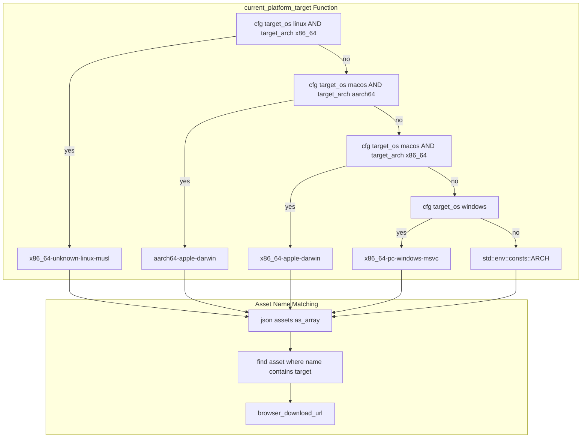

# Platform Target Detection

### From: mod

Platform target detection is the process of identifying the specific combination of operating system, CPU architecture, and ABI (Application Binary Interface) that determines which compiled binary variant can execute on the current system. The ragent updater implements this through compile-time conditional compilation using Rust's `cfg` attributes to match against `target_os` and `target_arch` configurations. The implementation maps common platform combinations to Rust's target triple nomenclature: 'x86_64-unknown-linux-musl' for 64-bit Linux with musl libc, 'aarch64-apple-darwin' and 'x86_64-apple-darwin' for macOS on Apple Silicon and Intel respectively, and 'x86_64-pc-windows-msvc' for 64-bit Windows with the Microsoft Visual C++ toolchain. This detection enables the updater to select the appropriate binary asset from GitHub releases, which are typically built for multiple targets in CI/CD pipelines. The approach assumes artifacts follow consistent naming conventions that include target triples, allowing substring matching against asset names. Fallback behavior uses the architecture string from environment constants when specific platform matching fails.

## Diagram

## External Resources

- [Rust reference on conditional compilation with cfg attributes](https://doc.rust-lang.org/reference/conditional-compilation.html) - Rust reference on conditional compilation with cfg attributes
- [Rust platform support documentation and target triples](https://doc.rust-lang.org/nightly/rustc/platform-support.html) - Rust platform support documentation and target triples

## Sources

- [mod](../sources/mod.md)
