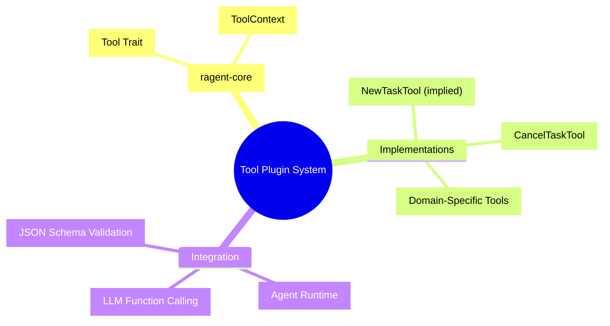

# Plugin Architecture for Agent Tools

### From: cancel_task

Plugin architectures enable extensible agent systems by defining clear interfaces that new capabilities can implement without modifying core framework code, supporting ecosystem growth and domain-specific customization. The ragent-core tool system exemplifies this through the `Tool` trait, which standardizes how capabilities expose themselves to the agent runtime while allowing diverse implementations ranging from simple calculations to complex external service integrations. This modularity supports incremental capability expansion where agent developers can add new tools without understanding internal framework mechanics, and enables selective capability deployment where different agent instances load only relevant tools for their domain. The architecture's use of JSON Schema for parameter definitions facilitates automatic user interface generation, input validation, and integration with large language model function-calling protocols that expect structured capability descriptions. Such plugin systems are increasingly critical in AI agent frameworks as the community explores composable agent behaviors, tool-use benchmarks, and federated capability repositories where tools can be shared across organizations and automatically discovered by agent orchestrators.

## Diagram

## External Resources

- [JSON Schema standard for validation and documentation](https://json-schema.org/) - JSON Schema standard for validation and documentation
- [OpenAI function calling for tool use by LLMs](https://platform.openai.com/docs/guides/function-calling) - OpenAI function calling for tool use by LLMs
- [Plugin computing pattern on Wikipedia](https://en.wikipedia.org/wiki/Plug-in_(computing)) - Plugin computing pattern on Wikipedia

## Sources

- [cancel_task](../sources/cancel-task.md)
