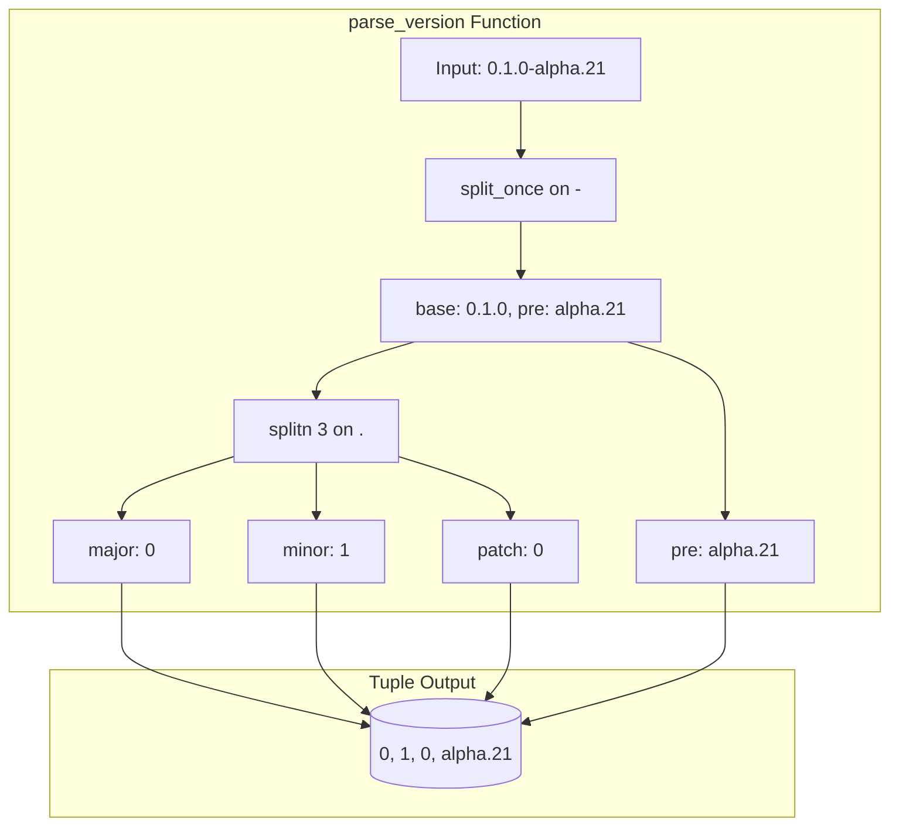

# Pre-Release Version Management

### From: mod

Pre-release version management addresses the complexities of distributing software during development phases before stable releases, where multiple iterative versions may be released for testing and feedback. The ragent updater handles pre-release versions through its custom `parse_version` function, which decomposes version strings like '0.1.0-alpha.21' into comparable components. The parsing strategy separates the semantic version core (major.minor.patch) from pre-release suffixes using the hyphen delimiter, then splits the core into numeric components. This enables correct precedence ordering where '0.1.0-alpha.22' is recognized as newer than '0.1.0-alpha.21', and '0.1.0' (stable) is newer than any '0.1.0-alpha.X' pre-release. The conservative handling of pre-release suffixes—treating them as lexicographic strings rather than parsed numeric components—simplifies comparison while remaining correct for common conventions. This approach supports continuous deployment workflows where frequent alpha or beta releases are published, allowing early adopters to receive updates automatically while maintaining clear version precedence semantics.

## Diagram

## External Resources

- [SemVer specification section on pre-release version precedence](https://semver.org/#spec-item-9) - SemVer specification section on pre-release version precedence
- [Cargo manifest version field documentation](https://doc.rust-lang.org/cargo/reference/manifest.html#the-version-field) - Cargo manifest version field documentation

## Related

- [Semantic Versioning](semantic-versioning.md)

## Sources

- [mod](../sources/mod.md)
