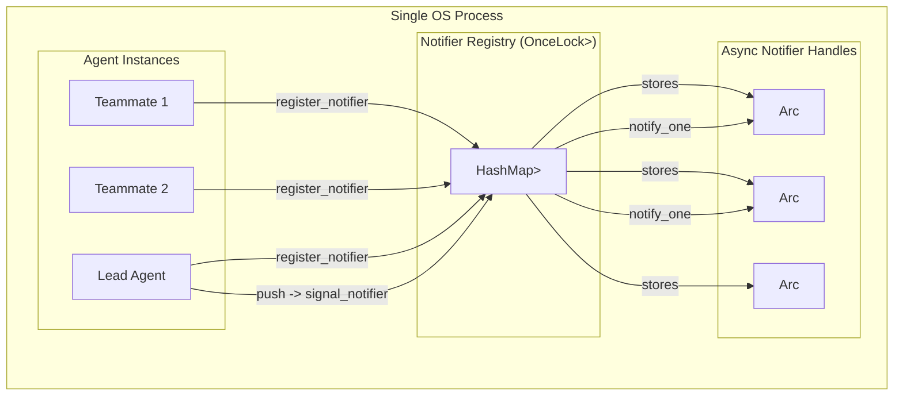

# Process-Wide Singleton Registry Pattern

### From: mailbox

The notifier registry implements a classic singleton pattern adapted for Rust's ownership and thread-safety requirements. The `notifier_map()` function returns a reference to a lazily-initialized global `HashMap` protected by `RwLock`, enabling any code in the process to register or query notifiers without explicit dependency injection. This pattern solves the practical problem of connecting message producers (any agent calling `push`) with consumers (specific agents' async runtimes) without threading complex references through the entire call stack.

The implementation uses `std::sync::OnceLock` for thread-safe, one-time initialization—superior to older `lazy_static!` patterns as it participates in Rust's const evaluation and has clearer drop semantics. The `RwLock<HashMap<...>>` provides interior mutability: read-heavy operations (`signal_notifier`) take read locks allowing concurrency, while registration mutations take exclusive write locks. The type alias `NotifyKey = (PathBuf, String)` creates a composite key combining filesystem location and agent identity, supporting multiple concurrent teams within the same process.

This pattern introduces global mutable state—a code smell in many contexts—but is justified here by the architectural requirement: notification must work across agent boundaries where explicit handle passing would be impractical. The `Arc<Notify>` values in the map allow shared ownership with the registering async task, with reference counting ensuring the `Notify` remains valid until explicitly deregistered. The `deregister_notifier` function prevents resource leaks and dangling notifications when agents shut down.

The pattern demonstrates sophisticated Rust concurrency: `std::sync` primitives for the global registry (suitable because registration is rare and brief), `tokio::sync` primitives for the notification itself (required for async compatibility). The error handling—`if let Ok(...)` rather than `unwrap()`—acknowledges that lock poisoning or other failures should not crash the entire system, instead gracefully degrading to polling-only behavior. This resilience is appropriate for a messaging layer where availability outweighs strict consistency requirements.

## Diagram

## External Resources

- [Rust standard library: OnceLock for lazy initialization](https://doc.rust-lang.org/std/sync/struct.OnceLock.html) - Rust standard library: OnceLock for lazy initialization
- [Parking_lot: high-performance synchronization primitives](https://docs.rs/parking_lot/latest/parking_lot/type.RwLock.html) - Parking_lot: high-performance synchronization primitives

## Sources

- [mailbox](../sources/mailbox.md)
