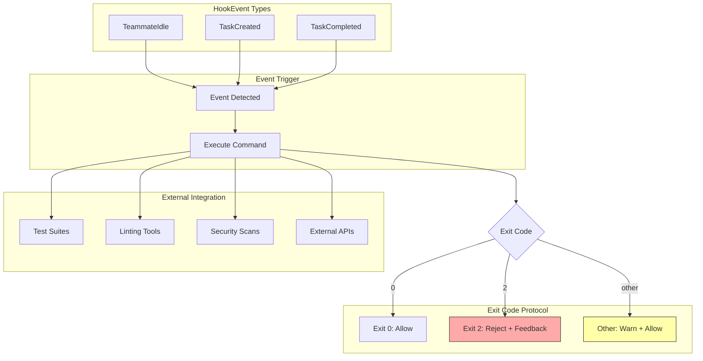

# Quality-Gate Hooks

### From: config

Quality-gate hooks are an extensibility mechanism that allows external validation and automation to be integrated into the agent team lifecycle. Each `HookEntry` pairs a `HookEvent`—such as `TeammateIdle`, `TaskCreated`, or `TaskCompleted`—with a shell command that executes when that event occurs. This design follows the Unix philosophy of composability, enabling ragent to integrate with arbitrary external tools, scripts, and services without bloating the core system with specialized integrations.

The hook protocol defines clear semantics through exit codes: exit 0 signals approval and allows the triggering action to proceed; exit 2 signals rejection with feedback delivered to the originating agent via stdout; other exit codes log warnings but permit continuation. This three-way distinction enables both hard gates (blocking actions that violate policy) and soft gates (logging and monitoring without interruption). For example, a `TaskCompleted` hook might run test suites, lint checks, or security scans, rejecting tasks with failing tests while merely warning about style violations.

Hooks execute as shell commands, providing maximum flexibility for integration with existing DevOps toolchains. Teams can invoke Docker containers for reproducible validation environments, call REST APIs for external approval workflows, or execute project-specific scripts maintained in version control. The `Vec<HookEntry>` structure in `TeamSettings` supports multiple hooks per event type, enabling phased validation pipelines where cheaper checks run before expensive ones. This pattern supports sophisticated workflows like requiring human sign-off through Slack integration before deploying to production, or automatically updating project dashboards when tasks complete.

## Diagram

## External Resources

- [Hooking in software development](https://en.wikipedia.org/wiki/Hooking) - Hooking in software development
- [Unix philosophy of composable tools](https://en.wikipedia.org/wiki/Unix_philosophy) - Unix philosophy of composable tools
- [GitHub Actions - similar hook-based automation](https://docs.github.com/en/actions) - GitHub Actions - similar hook-based automation

## Related

- [Event-Driven Architecture](event-driven-architecture.md)

## Sources

- [config](../sources/config.md)
