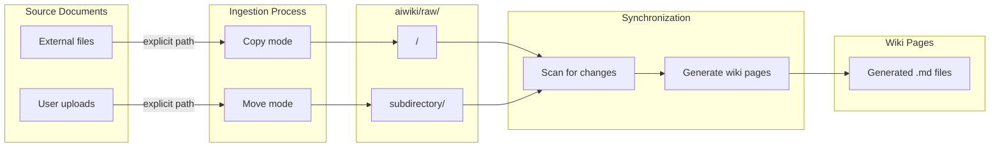

# Raw Folder Pattern

### From: aiwiki_ingest

The raw folder pattern is a content management convention that establishes a dedicated `raw/` directory as an intermediary staging area between source documents and processed outputs. This pattern serves multiple organizational and technical purposes in document processing workflows. By separating the original ingested content from generated wiki pages, the pattern preserves source integrity, enables reprocessing with updated algorithms, and provides a clear audit trail of what content has been introduced to the system. The `aiwiki/raw/` directory acts as a content-addressable or hierarchically organized repository where files await synchronization into the final knowledge base representation.

The pattern supports sophisticated ingestion workflows including the `move_file` option, which transfers original files into the raw folder rather than copying them. This is particularly valuable for managing reference materials and source documents that should be centrally archived within the project structure. The optional `subdirectory` parameter enables logical organization within the raw folder, allowing users to categorize content by source, type, or project phase. For example, research papers might be organized under `raw/references/` while meeting notes reside in `raw/meetings/`, maintaining clean separation while preserving the flat processing semantics of the ingestion pipeline.

A specialized variant of this pattern is implemented through `ingest_raw_directory`, which performs change detection scanning rather than explicit path-based ingestion. This mode compares the current state of the `raw/` folder against internal indexes to identify new or modified files, supporting incremental synchronization workflows. The scan-based approach is especially useful in CI/CD contexts where the presence of files in `raw/` triggers automated processing, or in collaborative environments where multiple contributors deposit content for later batch integration. The pattern's design reflects lessons from static site generators, data lake architectures, and version-controlled documentation systems, adapted for the specific requirements of AI-augmented knowledge management.

## Diagram

## External Resources

- [Git staging area concept analogous to raw folder pattern](https://git-scm.com/book/en/v2/Git-Basics-Recording-Changes-to-the-Repository) - Git staging area concept analogous to raw folder pattern
- [Data lake architectural pattern for raw storage](https://en.wikipedia.org/wiki/Data_lake) - Data lake architectural pattern for raw storage

## Sources

- [aiwiki_ingest](../sources/aiwiki-ingest.md)
