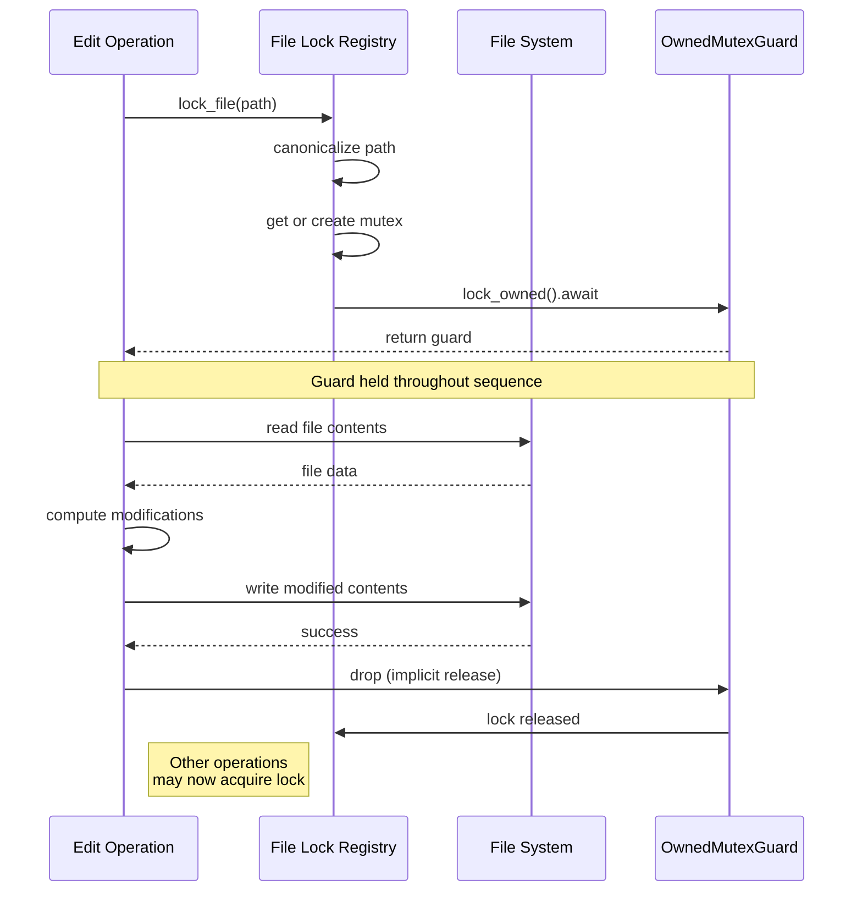

# Read-Modify-Write Pattern

### From: file_lock

The read-modify-write pattern is a fundamental concurrency idiom where an operation must first read a value, compute a modification based on that value, and then write the result back. This three-phase sequence appears deceptively simple but requires careful synchronization in concurrent environments because the read and write are not atomic relative to other operations. If another thread or task modifies the value between the read and write, the computation becomes based on stale data, leading to lost updates or other consistency violations.

In file system contexts, the read-modify-write pattern is ubiquitous: editing a file typically involves reading its contents, applying transformations, and writing the result back. The `lock_file` function in this source code specifically addresses this by requiring callers to hold the returned guard throughout the entire sequence. The guard acts as a capability token that proves exclusive access is held, and its lifetime (enforced by Rust's borrow checker) ensures the lock cannot be released prematurely. The documentation explicitly calls out that the guard "must be held for the duration of the read-modify-write sequence."

Modern systems employ various strategies to handle this pattern, including optimistic concurrency control (detecting conflicts and retrying), transactional memory (speculative execution with rollback), and pessimistic locking as shown here. The pessimistic approach trades some concurrency for simplicity and predictability—it guarantees forward progress for the holder at the cost of blocking others. This is particularly appropriate for file editing where operations are relatively long-lived and conflicts are expected to be common, making optimistic approaches potentially wasteful due to retry overheads.

## Diagram

## External Resources

- [Wikipedia article on read-modify-write pattern](https://en.wikipedia.org/wiki/Read-modify-write) - Wikipedia article on read-modify-write pattern
- [Rust RwLock documentation for reader-writer patterns](https://doc.rust-lang.org/std/sync/struct.RwLock.html) - Rust RwLock documentation for reader-writer patterns

## Sources

- [file_lock](../sources/file-lock.md)
