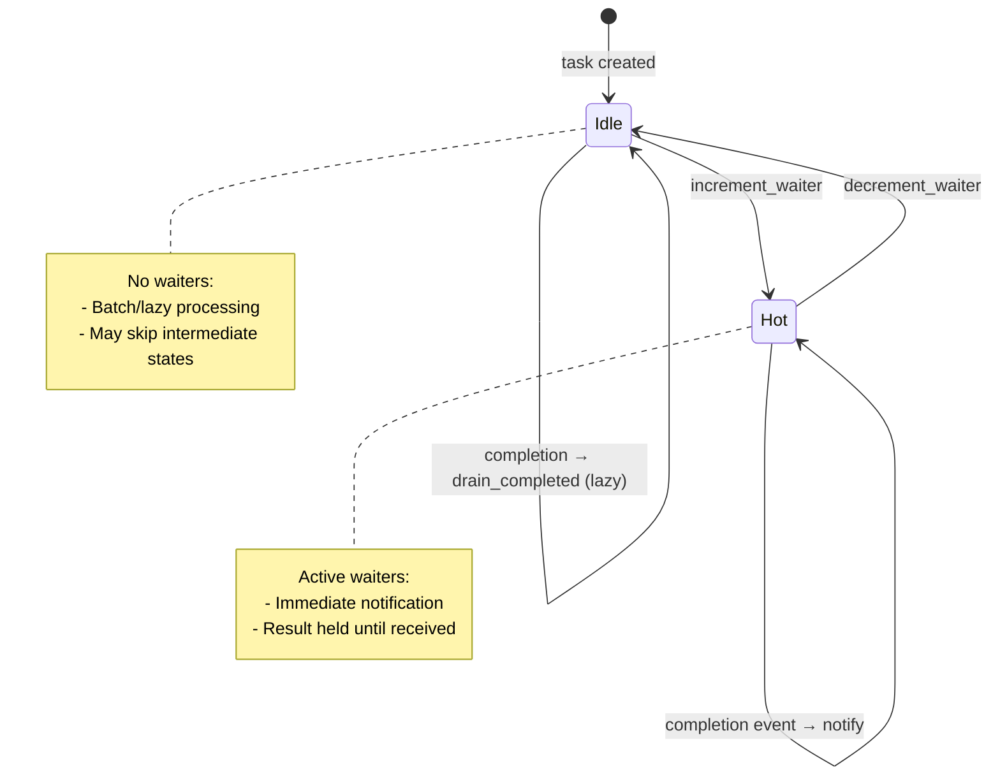

# Reference Counting for Event Optimization

### From: wait_tasks

Reference counting in WaitTasksTool enables an optimization where the task manager can distinguish between tasks that have active waiters and those that don't, allowing different notification strategies. The `increment_waiter` and `decrement_waiter` calls bracket the wait period, creating a lease-like mechanism where the task manager knows which tasks require push notification versus which can be lazily processed. This pattern is common in high-throughput systems where broadcasting all events to all consumers would create unacceptable overhead.

The implementation's careful cleanup—calling `decrement_waiter` for both completed and timed-out tasks using `results.keys().chain(waiting_for.iter())`—ensures the reference count returns to its pre-call state regardless of exit path. This uses Rust's iterator chaining to unify the two collections without allocation, demonstrating idiomatic Rust resource management. The failure to decrement would leak references, potentially causing the task manager to retain completed task data indefinitely or suppress cleanup operations.

This counting mechanism enables sophisticated behaviors in the task manager: a `drain_completed` method might skip tasks with zero waiters, or a notification system might use different channels for "hot" (has waiters) versus "cold" tasks. The pattern generalizes to any resource management scenario where consumers need to signal interest to providers, from database connection pooling to distributed cache invalidation. The explicit API—separate increment/decrement calls rather than RAII guards—reflects the async context where drop-based management would require `Drop` to be async, which Rust does not support directly.

## Diagram

## External Resources

- [Reference counting memory management technique](https://en.wikipedia.org/wiki/Reference_counting) - Reference counting memory management technique
- [Async Rust book on async drop workarounds](https://rust-lang.github.io/async-book/07_workarounds/03_async_drop.html) - Async Rust book on async drop workarounds

## Sources

- [wait_tasks](../sources/wait-tasks.md)
