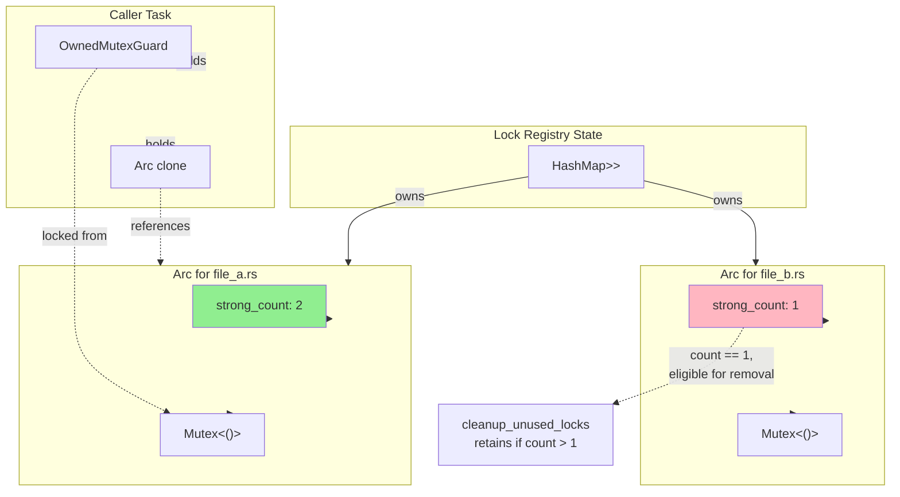

# Reference Counting for Resource Management

### From: file_lock

Reference counting is a memory management technique where each resource tracks the number of references to it, automatically deallocating when the count reaches zero. In concurrent systems, atomic reference counting (provided in Rust by `std::sync::Arc`) extends this to thread-safe shared ownership, allowing multiple owners across thread boundaries without requiring a global garbage collector. This file uses `Arc` at multiple levels: to share the global registry itself, and to share individual mutexes between the registry and waiting acquirers.

The particular pattern here—`Arc<Mutex<()>>` stored in a `HashMap`—enables dynamic lock creation with shared ownership semantics. When `lock_file` is called, it clones the `Arc` to obtain a new reference to the mutex, increments the reference count, and can then release the registry lock while still holding access to the specific file's mutex. This decoupling is crucial for performance: it prevents holding the global write lock during potentially lengthy lock acquisition waits, reducing contention on the central registry. The `strong_count` check in `cleanup_unused_locks` exploits this—if count is 1, only the registry holds a reference, so the file isn't being edited.

Reference counting differs from borrowing in Rust's ownership system by providing more flexible lifetimes at the cost of runtime overhead and potential memory leaks if cycles form. In this implementation, the structure is carefully acyclic: the registry owns arcs to mutexes, callers temporarily hold additional arcs, and the mutexes contain no back-references. The `Arc::strong_count` method provides introspection into sharing patterns, enabling the optional cleanup optimization that prevents unbounded HashMap growth during long sessions.

## Diagram

## External Resources

- [Rust Arc (atomic reference counting) documentation](https://doc.rust-lang.org/std/sync/struct.Arc.html) - Rust Arc (atomic reference counting) documentation
- [Rust book chapter on smart pointers and reference counting](https://doc.rust-lang.org/book/ch15-04-rc.html) - Rust book chapter on smart pointers and reference counting

## Sources

- [file_lock](../sources/file-lock.md)
