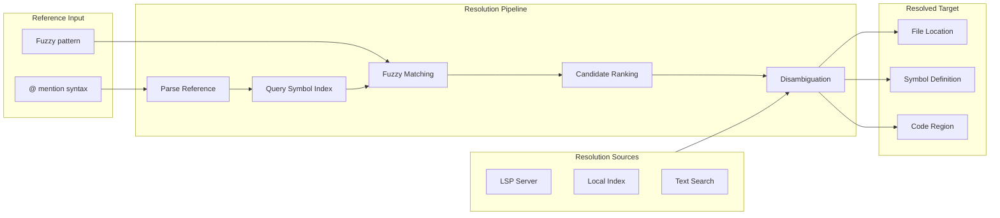

# Reference Resolution and Fuzzy Matching for Code Intelligence

### From: lib

The `reference` module implements sophisticated file reference parsing, resolution, and fuzzy matching capabilities that enable natural, intuitive interaction with codebase locations. The module documentation specifically cites "SPEC §3.34", indicating formal specification compliance for the @-mention syntax commonly used in development tools to refer to files, symbols, or code regions. This functionality bridges the gap between human-readable location descriptions and precise machine-actionable references, allowing users (and the LLM) to specify targets like "@src/main.rs:45" or "@UserController" with intelligent disambiguation when multiple matches exist. The fuzzy matching component handles inevitable approximations in LLM-generated references, finding the best candidate when exact matches fail.

Reference resolution in large codebases presents significant technical challenges involving symbol indexing, path resolution across module boundaries, and context-sensitive disambiguation. The implementation likely maintains indices of project symbols with metadata about their types, scopes, and relationships, enabling rapid candidate generation for ambiguous references. Fuzzy matching algorithms must balance recall (finding relevant matches) against precision (avoiding false positives), potentially employing techniques like trigram indexing, edit distance calculations, and frequency-based ranking. The integration with the LSP module suggests that reference resolution can leverage language servers for accurate semantic understanding when available, falling back to text-based heuristics for unsupported languages or offline operation.

This capability is fundamental to effective AI coding assistance because LLMs naturally produce approximate references to code entities that require grounding in actual project structure. Without robust reference resolution, agents would either fail on imperfect references or require excessive clarification turns, degrading user experience. The specification compliance (SPEC §3.34) suggests interoperability considerations, potentially enabling shared reference syntax across tools in the ragent ecosystem or with external integrations. Advanced features might include reference validation to detect stale mentions, hyperlink generation for rich output formats, and confidence scoring to determine when human clarification is warranted versus automatic best-guess resolution.

## Diagram

## External Resources

- [Fuzzy string matching algorithms overview](https://en.wikipedia.org/wiki/Approximate_string_matching) - Fuzzy string matching algorithms overview
- [ripgrep fast searcher - similar indexing challenges in code search](https://github.com/BurntSushi/ripgrep) - ripgrep fast searcher - similar indexing challenges in code search

## Related

- [Fuzzy String Matching](fuzzy-string-matching.md)

## Sources

- [lib](../sources/lib.md)
