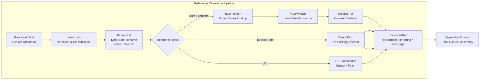

# Reference Resolution Pipeline

### From: mod

The reference resolution pipeline is the architectural pattern underlying the three-stage processing of `@` references in Ragent Core. This pattern structures the transformation of raw user input into actionable content through discrete, composable stages: parsing (detection and classification), matching (fuzzy disambiguation), and resolution (content retrieval). Each stage operates on well-defined types—`ParsedRef` from parsing, enriched by `FuzzyMatch` if needed, yielding `ResolvedRef`—creating a clear data flow that simplifies reasoning about the system. This pipeline architecture is widely applicable in compilers, data processing systems, and command interpreters, where complex transformations benefit from decomposition into verifiable steps.

The parsing stage (`parse_refs` function) performs lexical analysis on input text, identifying `@` sequences and classifying them by type: bare filename, relative path, directory reference, or URL. This classification determines which downstream handlers are applicable. The matching stage (`fuzzy_match` and `collect_project_files`) activates specifically for bare filenames, consulting the project index to find probable matches. The resolution stage (`resolve_ref` and `resolve_all_refs`) performs the actual I/O operations: reading file contents, listing directory entries recursively, or fetching URL responses. The `resolve_all_refs` variant enables batch processing, which is essential for efficiency when multiple references appear in a single prompt.

Error handling in pipeline architectures requires careful design to provide meaningful feedback without leaking implementation complexity. Each stage can fail independently: parsing might encounter malformed references, matching might find no candidates, resolution might encounter permission errors or network failures. The Rust `Result` type naturally expresses these possibilities, with `ResolvedRef` likely containing either success content or structured error information. The pipeline also supports cross-cutting concerns like caching (avoiding repeated fetches of the same URL), logging (for debugging reference resolution), and security (validating that resolved paths stay within allowed boundaries). This separation of concerns makes the system maintainable and testable, with unit tests targeting individual stages and integration tests verifying end-to-end flows. The pattern demonstrates how functional programming principles—pure transformations, immutable data, and explicit error propagation—enhance reliability in systems that bridge human input and external resources.

## Diagram

## External Resources

- [Software pipeline pattern on Wikipedia](https://en.wikipedia.org/wiki/Pipeline_(software)) - Software pipeline pattern on Wikipedia
- [Rust Result type and error handling - official Rust documentation](https://doc.rust-lang.org/book/ch09-02-recoverable-errors-with-result.html) - Rust Result type and error handling - official Rust documentation
- [LLVM/Clang compilation pipeline - example of industrial-strength pipeline architecture](https://clang.llvm.org/docs/InternalsManual.html#the-compilation-process) - LLVM/Clang compilation pipeline - example of industrial-strength pipeline architecture

## Related

- [@ syntax for references](syntax-for-references.md)
- [fuzzy file matching](fuzzy-file-matching.md)

## Sources

- [mod](../sources/mod.md)
