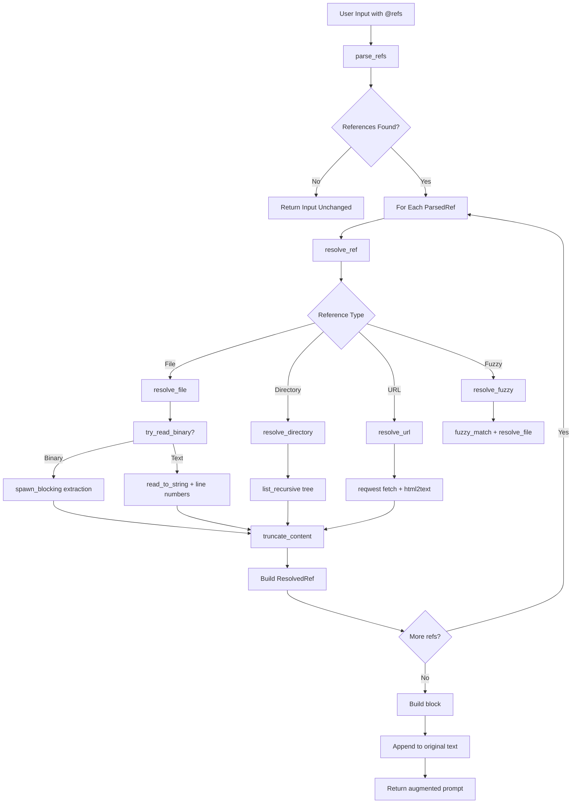

# Reference-Style Markup Injection

### From: resolve

Reference-style markup injection is a technique for augmenting natural language prompts with structured, delimited content blocks that provide external context to language models while maintaining clear boundaries between user intent and retrieved information. The `resolve_all_refs` function generates `<referenced_files>` XML-like blocks containing tagged content from resolved references, using semantic markup (`<file path="...">`, `<file url="...">`) to indicate source provenance. This pattern enables LLMs to distinguish between the user's original query and supplementary materials, potentially applying different attention weights or citation behaviors. The injection strategy appends rather than interleaves content, preserving the conversational flow while ensuring referenced materials are available for grounding. The technique parallels similar patterns in RAG systems, function calling APIs, and context augmentation frameworks, where structural boundaries help models utilize external knowledge effectively. Error handling includes graceful degradation—unresolvable references generate warnings rather than failures—maintaining partial functionality when some sources are unavailable.

## Diagram

## External Resources

- [Retrieval-Augmented Generation for Knowledge-Intensive NLP Tasks (original RAG paper)](https://arxiv.org/abs/2005.11401) - Retrieval-Augmented Generation for Knowledge-Intensive NLP Tasks (original RAG paper)
- [Prompt Engineering Guide with context injection patterns](https://www.promptingguide.ai/) - Prompt Engineering Guide with context injection patterns

## Sources

- [resolve](../sources/resolve.md)
