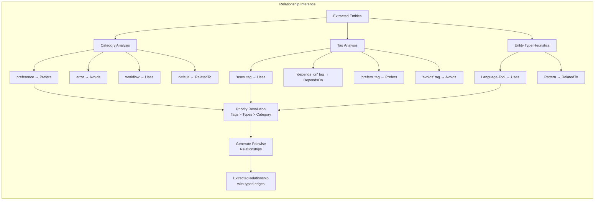

# Relationship Inference

### From: knowledge_graph

Relationship inference transforms co-occurring entities into semantically typed connections through contextual analysis of memory metadata, implementing a lightweight form of relation extraction without natural language understanding. The inference algorithm first establishes a default relationship type based on memory category—preference memories default to Prefers, error memories to Avoids, workflow memories to Uses—encoding domain knowledge about how different memory types typically express entity relationships. This category-driven approach achieves reasonable accuracy for common cases while remaining computationally trivial.

The secondary inference layer examines memory tags for explicit relationship indicators, overriding category defaults when tags like "uses", "depends_on", "prefers", or "avoids" are present. This tag-based mechanism enables users to disambiguate relationships that category alone cannot capture, and supports fine-grained control over relationship semantics. The tertiary layer applies entity-type heuristics, such as inferring Uses relationships between Language and Tool entities based on typical adoption patterns. These layered inference rules create a cascade where explicit signals override implicit defaults, producing more accurate relationship typing than any single signal alone.

The complete inference generates fully-connected relationship graphs among extracted entities, with O(n²) complexity for n entities creating pairwise relationships. This dense connectivity supports graph traversal queries but may over-represent weak associations; future enhancements might include distance-based thresholding or co-occurrence frequency analysis to prune spurious edges. The determine_relation function's extensible match structure facilitates adding new inference rules, while confidence scoring in the Relationship struct enables downstream filtering by relationship quality.

## Diagram

## External Resources

- [Relation extraction in NLP](https://en.wikipedia.org/wiki/Relation_extraction) - Relation extraction in NLP
- [Co-occurrence networks](https://en.wikipedia.org/wiki/Co-occurrence_network) - Co-occurrence networks

## Related

- [Entity Extraction](entity-extraction.md)

## Sources

- [knowledge_graph](../sources/knowledge-graph.md)
