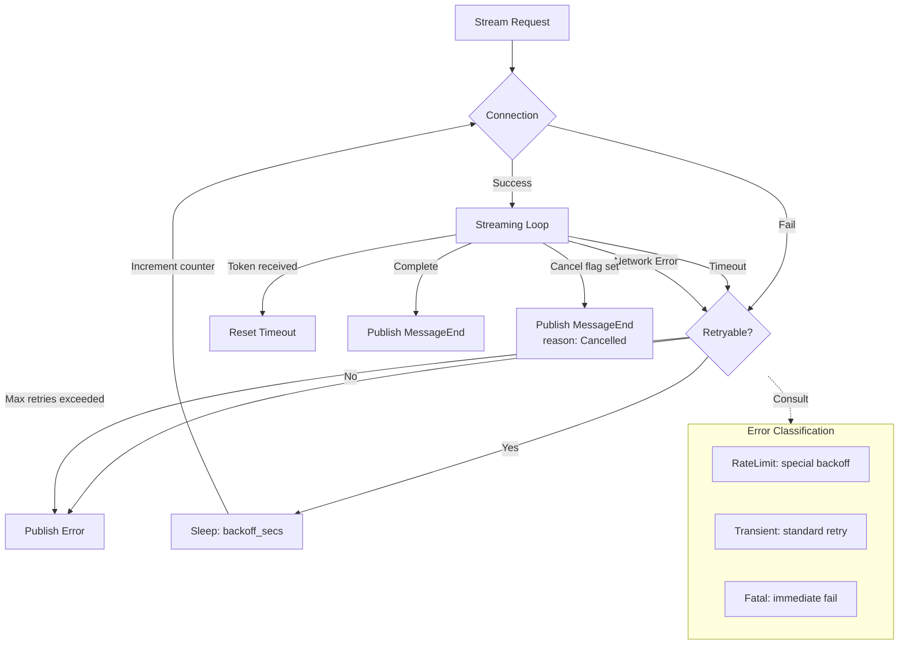

# Resilience Patterns for LLM Streaming

### From: processor

Resilience engineering for LLM streaming addresses the inherent unreliability of network-dependent AI services through multiple defensive layers. The `SessionProcessor` implements configurable retry logic with `max_retries`, `retry_backoff_secs`, and `timeout_secs` parameters from `stream_config`, creating exponential backoff patterns that prevent thundering herd problems while maximizing success probability. The `is_retryable_stream_error` function implements discriminated failure analysis, distinguishing transient network errors (eligible for retry) from persistent semantic failures (requiring user intervention).

The timeout configuration spans multiple granularities: connection establishment, inter-token latency (preventing hangs on partial responses), and overall operation bounds. This layered timeout strategy prevents resource exhaustion from stuck connections while avoiding premature termination of slow-but-valid generations. The backoff implementation using `tokio::time::sleep` with `Duration::from_secs` enables cooperative scheduling within the async runtime.

The cancellation architecture demonstrates graceful degradation—`Arc<AtomicBool>` provides lock-free polling of user cancellation requests, checked at stream consumption boundaries to enable prompt termination without resource leaks. This contrasts with less robust patterns that might require async task abortion. The error classification (`RateLimit`, `QuotaUpdate`) suggests integration with provider-specific rate limit headers, enabling intelligent backoff rather than fixed intervals. The combination of these patterns—retries with backoff, discriminated errors, layered timeouts, and cooperative cancellation—constitutes a production-grade reliability framework appropriate for mission-critical agent deployments.

## Diagram

## External Resources

- [Google SRE book: Handling overload](https://sre.google/sre-book/handling-overload/) - Google SRE book: Handling overload
- [AWS builders library: Timeouts, retries, and backoff](https://aws.amazon.com/builders-library/timeouts-retries-and-backoff-with-jitter/) - AWS builders library: Timeouts, retries, and backoff

## Sources

- [processor](../sources/processor.md)
