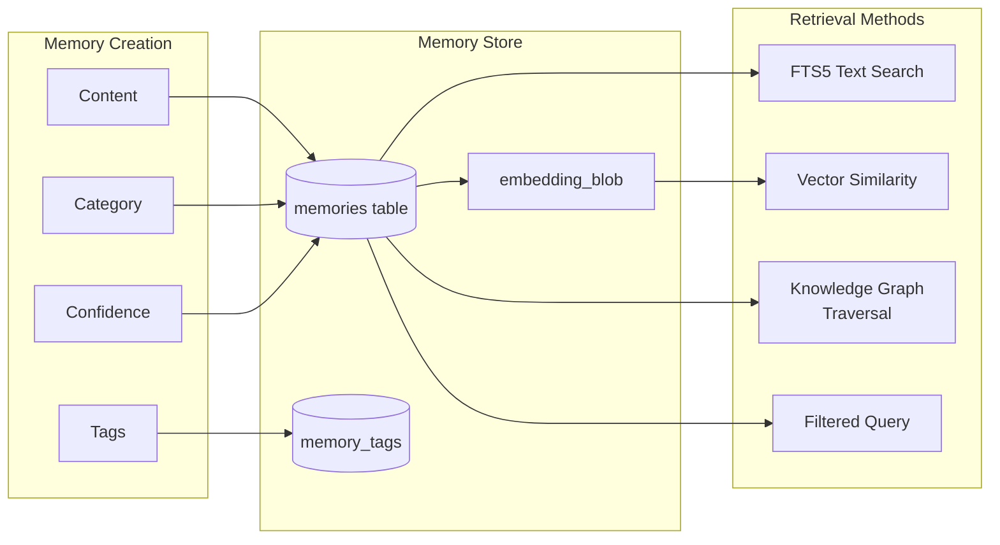

# Retrieval-Augmented Generation Memory System

### From: mod

The structured memory system in ragent storage implements architectural patterns for retrieval-augmented generation (RAG), where AI agents retrieve relevant context from persistent knowledge to enhance response quality. Unlike simple conversation history, this system categorizes memories by type (fact, pattern, preference, insight, error, workflow) and assigns confidence scores, enabling intelligent filtering and prioritization. The database schema supports multi-dimensional retrieval: temporal (recent memories), categorical (by type), confidence-weighted, tag-filtered, and critically, semantic similarity through vector embeddings. This multi-modal retrieval enables agents to surface contextually relevant information even when keyword matching would fail.

The embedding subsystem stores serialized vector representations of memories and journal entries, supporting cosine similarity search for semantic retrieval. Functions like search_memories_by_embedding and search_journal_by_embedding accept query embeddings (typically from language models) and return results ranked by vector similarity above configurable thresholds. This enables natural language queries to retrieve relevant context without exact keyword matches. The embedding storage uses BLOB columns with companion listing functions for batch retrieval, suggesting integration with external embedding services or local models. The similarity search implementation likely computes cosine similarity in Rust, enabling efficient in-database filtering with application-level scoring.

Memory maintenance includes sophisticated lifecycle management: access tracking (increment_memory_access, last_accessed timestamps), confidence updating, content mutation, and policy-based deletion through ForgetFilter criteria combining age, confidence, category, and tags. This supports emergent forgetting behaviors where low-confidence, rarely-accessed, or outdated memories can be purged. The knowledge graph functionality (entities and relationships) enables graph-based retrieval where connected information can be traversed, supporting complex reasoning patterns beyond flat similarity search. Together these features constitute a comprehensive cognitive architecture for persistent agent memory.

## Diagram

## External Resources

- [Retrieval-augmented generation on Wikipedia](https://en.wikipedia.org/wiki/Retrieval-augmented_generation) - Retrieval-augmented generation on Wikipedia
- [Vector similarity fundamentals from Pinecone](https://www.pinecone.io/learn/vector-similarity/) - Vector similarity fundamentals from Pinecone
- [OpenAI embeddings guide for semantic search](https://platform.openai.com/docs/guides/embeddings) - OpenAI embeddings guide for semantic search
- [Knowledge graph concepts and applications](https://en.wikipedia.org/wiki/Knowledge_graph) - Knowledge graph concepts and applications

## Sources

- [mod](../sources/mod.md)
