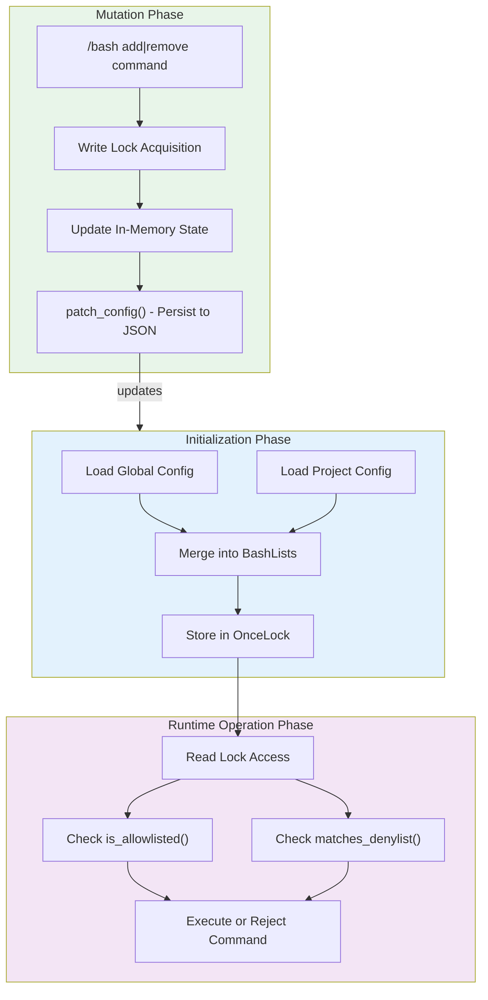

# Runtime Security Policy Management

### From: bash_lists

Runtime security policy management refers to systems that enforce and modify security rules during program execution rather than solely at compile time or startup. In the ragent context, this concept enables dynamic adjustment of command execution permissions through slash commands that immediately affect behavior and persist changes for future sessions. This approach balances security with usability: static policies risk being overly restrictive or permissive for diverse use cases, while fully dynamic policies without persistence would require reconfiguration on every restart. The module implements this through a three-phase lifecycle: initialization (loading merged configs), operation (in-memory validation), and mutation (persisted updates), with each phase optimized for its specific constraints.

The design reflects lessons from capabilities-based security and sandboxing systems, where policies should be explicit, auditable, and minimally scoped. By providing both allowlist and denylist mechanisms, the system supports both positive (permit-only) and negative (deny-specific) security models, allowing users to choose their preferred posture. The persistence layer ensures that security decisions are durable and reviewable through standard version control when project-scoped. This pattern appears in many modern developer tools, from git hooks to CI/CD pipeline configurations, where local flexibility must coexist with team standards and audit requirements. The use of JSON for persistence prioritizes human readability and tooling ecosystem compatibility over more efficient binary formats, recognizing that configuration files are frequently edited and reviewed directly.

## Diagram

## External Resources

- [NIST Cybersecurity Framework - guidance on risk-based security policy management](https://csrc.nist.gov/publications/detail/white-paper/2018/01/04/cybersecurity-framework-v12-final) - NIST Cybersecurity Framework - guidance on risk-based security policy management
- [OWASP Proactive Controls - security capabilities and patterns for software development](https://owasp.org/www-project-proactive-controls/) - OWASP Proactive Controls - security capabilities and patterns for software development

## Related

- [Allowlist/Denylist Pattern](allowlist-denylist-pattern.md)

## Sources

- [bash_lists](../sources/bash-lists.md)
