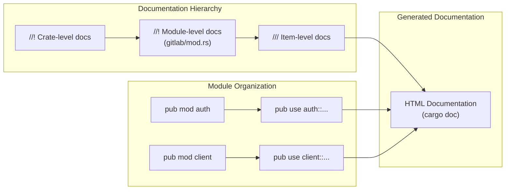

# Rust Documentation and Module Organization

### From: mod

Rust documentation and module organization encompasses the conventions and tools used to create maintainable, discoverable codebases through structured module hierarchies and comprehensive inline documentation. Rust's documentation system, powered by rustdoc, treats documentation comments (marked with `//!` for module-level and `///` for item-level) as first-class citizens, automatically generating searchable HTML documentation that integrates with the broader crate ecosystem via docs.rs. The ragent GitLab module demonstrates effective application of these conventions through its module-level documentation comment that succinctly describes the module's purpose, key types (`GitLabClient`), and security characteristics (encrypted storage, override options). This approach enables developers to understand module functionality through `cargo doc` generated documentation without reading source code, accelerating onboarding and API comprehension. The module organization follows Rust's visibility rules, where the `pub mod` declarations expose submodules while `pub use` statements re-export specific items to create a curated public API. This pattern—sometimes called the "facade pattern" or "thin module root"—allows internal restructuring without breaking downstream consumers, as the public interface remains stable even when implementation details change. The explicit documentation of credential override mechanisms in the module docstring further exemplifies Rust's culture of documenting not just what code does, but important operational characteristics that affect deployment and security posture.

## Diagram

## External Resources

- [Rust by Example: Documentation](https://doc.rust-lang.org/rust-by-example/meta/doc.html) - Rust by Example: Documentation
- [docs.rs - Rust documentation hosting](https://docs.rs/) - docs.rs - Rust documentation hosting

## Related

- [Modular API Client Architecture](modular-api-client-architecture.md)

## Sources

- [mod](../sources/mod.md)
