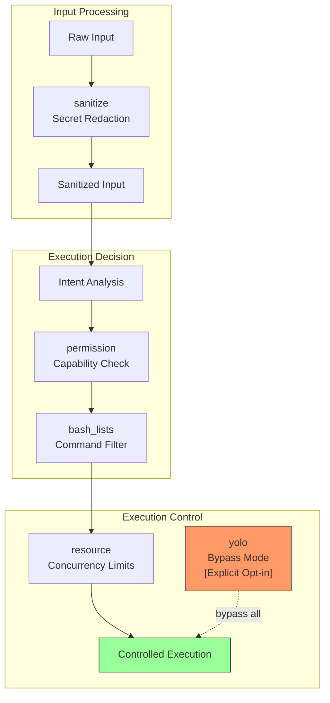

# Security-First Agent Design: Permission Layers and Input Sanitization

### From: lib

Security in AI agent systems presents unique challenges due to the intersection of natural language understanding, code execution, and autonomous decision-making. The ragent-core library demonstrates a defense-in-depth approach through dedicated modules for permission management (`permission`), command filtering (`bash_lists`), input sanitization (`sanitize`), and resource constraints (`resource`). The bash_lists module implements runtime allowlist/denylist enforcement persisted in configuration, enabling administrators to explicitly define which shell commands the agent may execute and prohibiting dangerous operations regardless of LLM output. This addresses a critical attack vector where prompt injection or jailbreaking attempts could otherwise induce harmful command execution.

The sanitize module provides secret redaction capabilities, recognizing that development workflows frequently encounter sensitive material including API keys, database credentials, and personal access tokens. Automated redaction prevents these secrets from entering LLM context windows where they could be logged by third-party providers or inadvertently revealed in generated content. This protection extends beyond simple pattern matching to likely include entropy analysis, known format detection, and integration with secret scanning databases. The combination of execution filtering and secret protection addresses the two primary confidentiality and integrity risks in coding agents: unauthorized system modification and credential exposure.

The permission module likely implements a capabilities-based access model where specific agent operations require explicit grants that can be scoped temporally and contextually. This enables workflows where, for example, filesystem modifications are permitted within a project directory but prohibited elsewhere, or network access is restricted to specific endpoints. Resource limits provide the final safety layer by constraining concurrent process execution, preventing fork bombs or resource exhaustion attacks. The existence of "YOLO mode"—documented as bypassing all validation—reveals pragmatic recognition that security controls can impede legitimate rapid development, while their isolation to an explicit opt-in mode maintains safe defaults. This comprehensive security architecture reflects lessons from production AI agent deployments where insufficient safeguards led to real-world incidents.

## Diagram

## External Resources

- [OWASP Top 10 for LLM Applications - security risks in AI systems](https://owasp.org/www-project-top-10-for-large-language-model-applications/) - OWASP Top 10 for LLM Applications - security risks in AI systems
- [OpenAI safety best practices for AI applications](https://platform.openai.com/docs/guides/safety-best-practices) - OpenAI safety best practices for AI applications
- [Gitleaks secret detection tool - similar patterns to sanitize module](https://github.com/gitleaks/gitleaks) - Gitleaks secret detection tool - similar patterns to sanitize module

## Sources

- [lib](../sources/lib.md)
