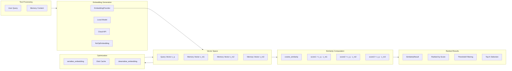

# Semantic Embedding Search

### From: mod

Semantic embedding search represents a fundamental advancement over traditional information retrieval, enabling machines to understand conceptual similarity rather than merely matching character sequences. In keyword-based search, queries must contain exact or stemmed matches to document terms to retrieve relevant results, failing when terminology differs between questions and answers. Embedding search overcomes this limitation by mapping text into high-dimensional vector spaces where proximity correlates with semantic relatedness, enabling retrieval of conceptually appropriate content even when vocabulary diverges. For agent memory systems, this capability is transformative—agents can recall relevant expertise using natural language descriptions without requiring precise terminology matching between current situations and stored memories.

The mathematical foundation rests on representation learning, where neural networks encode text into dense vectors capturing distributional semantics. The `cosine_similarity` function in ragent's embedding module computes the cosine of the angle between vectors, yielding a normalized similarity score independent of vector magnitude. This metric is preferred over Euclidean distance for semantic search because it focuses on directional alignment (shared meaning) rather than absolute position, accommodating that semantically similar documents may differ in length and verbosity. The `SimilarityResult` type encapsulates these computations with relevance rankings, enabling threshold-based filtering and top-k retrieval of the most pertinent memories for a given context.

Production embedding search requires careful engineering around several challenges. Computation cost demands strategies like the serialization functions (`serialise_embedding`, `deserialise_embedding`) that cache embeddings rather than recomputing them on each query. Dimensionality considerations balance expressiveness (higher dimensions capture finer semantic distinctions) against storage and computation efficiency (lower dimensions enable faster similarity calculations). The `NoOpEmbedding` fallback demonstrates defensive design for degraded operation when embedding services are unavailable, though semantic search quality degrades to random or heuristic ordering without proper embeddings. Model selection involves trade-offs between local inference (privacy, latency, cost) and API-based services (quality, maintenance, dependency), with the `EmbeddingProvider` trait enabling runtime flexibility.

For ragent specifically, semantic search enables sophisticated memory behaviors impossible with keyword approaches. Agents can find "error handling patterns" when memories describe "exception management" or "failure recovery." Cross-lingual retrieval becomes possible when embeddings map equivalent concepts across languages into nearby vectors. Analogical reasoning emerges from vector arithmetic—if embeddings capture that "king - man + woman ≈ queen," similar relationships among code patterns may enable suggestion of appropriate implementations based on structural similarities rather than explicit documentation. The integration with knowledge graphs enables hybrid retrieval combining semantic similarity with explicit relationship traversal, surfacing not just individually relevant memories but clusters of related knowledge that together provide comprehensive context for complex situations.

## Diagram

## External Resources

- [OpenAI's explanation of text embeddings](https://platform.openai.com/docs/guides/embeddings/what-are-embeddings) - OpenAI's explanation of text embeddings
- [Word2Vec - foundational word embedding research](https://arxiv.org/abs/1301.3781) - Word2Vec - foundational word embedding research
- [Sentence-BERT semantic search implementation](https://www.sbert.net/examples/applications/semantic-search/README.html) - Sentence-BERT semantic search implementation
- [Vector space model for information retrieval](https://en.wikipedia.org/wiki/Vector_space_model) - Vector space model for information retrieval

## Related

- [Persistent Agent Memory](persistent-agent-memory.md)

## Sources

- [mod](../sources/mod.md)
