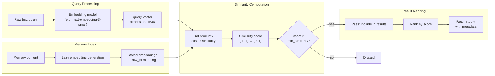

# Semantic Search with Vector Embeddings

### From: memory_search

Semantic search represents a fundamental shift from lexical matching to meaning-based retrieval in information systems. Unlike traditional keyword search that matches exact or stemmed word forms, semantic search encodes queries and documents as high-dimensional dense vectors (embeddings) where spatial proximity corresponds to semantic similarity. In MemorySearchTool, this manifests as cosine similarity computation between query embeddings and stored memory embeddings, enabling retrieval of conceptually related content even when vocabulary differs completely. For example, a query about "increasing system throughput" could match memories discussing "performance optimization" or "load balancing" without sharing any keywords.

The implementation details reveal production considerations often glossed over in research presentations. Lazy embedding generation ensures that enabling semantic search doesn't require expensive batch reprocessing of existing memories—new embeddings are computed on-demand during the first search that encounters unembedded content. Similarity thresholding (min_similarity parameter, default 0.3) provides tunable precision-recall control: higher thresholds reduce false positives at the cost of potentially missing relevant but distantly related content. The fallback to FTS5 when embeddings fail or are unavailable demonstrates operational pragmatism; semantic search is a progressive enhancement rather than hard dependency.

The mathematical foundation rests on the observation that neural network embeddings capture distributional semantics—words and concepts appearing in similar contexts obtain similar vector representations. This property, emergent from training on large text corpora with objectives like masked language modeling or contrastive learning, enables cross-lingual retrieval and conceptual abstraction. However, the implementation also hints at limitations: embedding quality depends on training data distribution, out-of-domain queries may map to unexpected regions of vector space, and the black-box nature of similarity scores can complicate debugging. MemorySearchTool's explicit mode tracking in events ("semantic" vs "fts") supports operational monitoring of these tradeoffs in production.

## Diagram

## External Resources

- [Dense Passage Retrieval for Open-Domain QA (Karpukhin et al., 2021)](https://arxiv.org/abs/2104.05740) - Dense Passage Retrieval for Open-Domain QA (Karpukhin et al., 2021)
- [Sentence-BERT models for semantic similarity tasks](https://huggingface.co/sentence-transformers) - Sentence-BERT models for semantic similarity tasks
- [OpenAI embeddings API and cosine similarity explanation](https://platform.openai.com/docs/guides/embeddings/what-are-embeddings) - OpenAI embeddings API and cosine similarity explanation
- [Practical guide to text embeddings for search applications](https://www.deepset.ai/blog/the-beginners-guide-to-text-embeddings) - Practical guide to text embeddings for search applications

## Sources

- [memory_search](../sources/memory-search.md)
