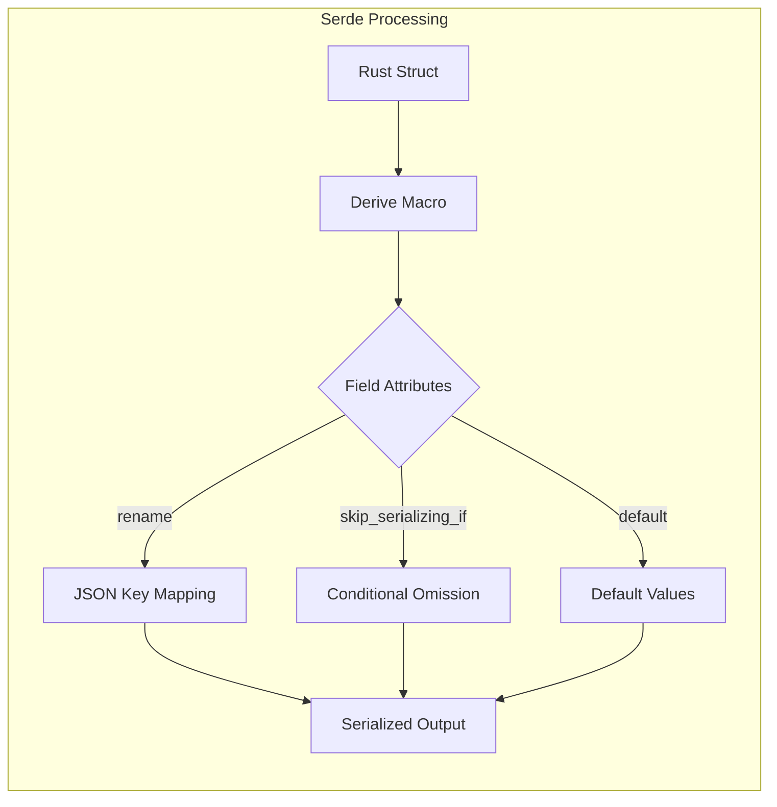

# Serde Serialization Patterns

### From: visualisation

The visualisation module demonstrates sophisticated usage of serde, Rust's serialization framework, employing multiple advanced patterns for controlling JSON output structure and content. The pervasive derive(Serialize, Deserialize) macros provide automatic trait implementation, while field-level attributes enable fine-grained customization. The #[serde(rename = "type")] pattern handles Rust reserved keywords—type is a valid field name in Rust but requires quoting in JSON contexts, so the attribute maps to the bare string. This pattern commonly appears when Rust structures mirror external schema requirements like API specifications or database conventions.

The skip_serializing_if attribute on optional fields implements conditional serialization based on runtime values, reducing payload size and simplifying client-side handling by omitting rather than null-encoding absent data. This proves particularly valuable for GraphNode's avg_confidence (irrelevant for tag nodes) and TagCloudEntry's journal_count (frequently absent), following JSON API design principles where explicit nulls often require special client handling. The combination with Option types creates a three-state logic: Some(value) serializes the value, None with skip_serializing_if omits the field entirely, and explicit null would require Option<Option<T>> or similar workaround.

Documentation comments preceding structs serve dual purposes as Rust docstrings and implicit schema documentation, with the exclamation-marked header establishing module-level purpose. The to_string_pretty usage in tests generates formatted JSON for human-readable assertion failures, while production code would likely use compact serialization for network efficiency. These patterns collectively demonstrate production-grade serde usage prioritizing API ergonomics, bandwidth efficiency, and maintainability—characteristic of systems designed for long-term evolution where backward-compatible serialization changes preserve client integrations.

## Diagram

## External Resources

- [Serde field attributes reference documentation](https://serde.rs/field-attrs.html) - Serde field attributes reference documentation
- [serde_json crate for JSON serialization in Rust](https://docs.rs/serde_json/latest/serde_json/) - serde_json crate for JSON serialization in Rust

## Sources

- [visualisation](../sources/visualisation.md)
