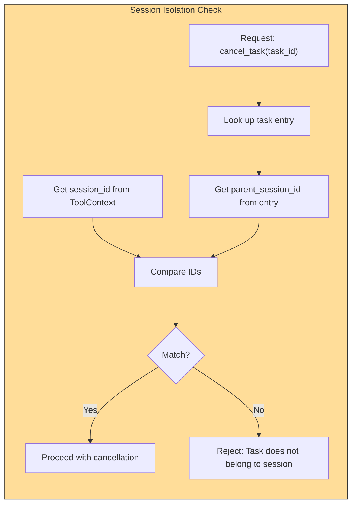

# Session-Based Security Isolation

### From: cancel_task

Session-based security isolation in multi-agent systems establishes boundaries that prevent cross-contamination between distinct execution contexts, ensuring that agents operating in one session cannot interfere with resources belonging to another. The `CancelTaskTool` enforces this isolation by verifying that the `parent_session_id` stored with each task matches the `session_id` of the requesting context before permitting cancellation operations. This security model addresses critical concerns in multi-tenant agent deployments where unrelated user sessions may execute concurrently on shared infrastructure, preventing malicious or buggy agents from disrupting others' operations. The implementation pattern reflects principles from capability-based security and context-bound access control, where permissions are derived from possession of valid session identifiers rather than global administrative privileges. Such isolation mechanisms are essential for building trustworthy agent platforms that can safely host autonomous agents from multiple users or organizations while maintaining strict confidentiality and availability guarantees.

## Diagram

## External Resources

- [CIS Controls for session management security](https://www.cisecurity.org/controls/session-management) - CIS Controls for session management security
- [Capability-based security introduction](https://research.cs.wisc.edu/areas/os/Security/capability/) - Capability-based security introduction

## Sources

- [cancel_task](../sources/cancel-task.md)
