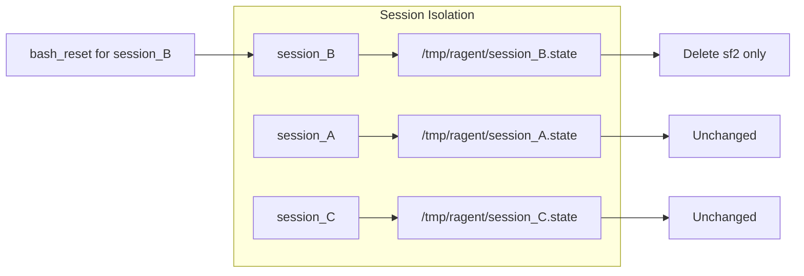

# Session-Based State Isolation

### From: bash_reset

Session-based state isolation is an architectural pattern that partitions persistent data by session identifier, ensuring that concurrent or sequential agent operations maintain independent state contexts. In the ragent-core implementation, this pattern manifests through the `session_id` field in `ToolContext`, which serves as a namespace for state file organization. Each session receives its own isolated persistence layer, preventing interference between different agent tasks or concurrent agent instances sharing the same execution environment.

The implementation strategy visible in `bash_reset.rs` uses the session identifier to construct unique filesystem paths via the `state_file_path` function, creating a mapping from logical session identity to physical storage location. This approach enables multi-tenancy at the process level, where a single ragent-core deployment can support numerous independent sessions without cross-contamination of state. The isolation extends beyond simple file separation to encompass the conceptual boundary of an agent's operational context—what happens in one session remains confined to that session unless explicitly shared.

The reset operation's interaction with session isolation is particularly noteworthy: it removes state only for the specific session identified in the `ToolContext`, leaving other sessions unaffected. This granular control supports sophisticated agent workflows where partial resets or session-specific recovery operations are required. The pattern also facilitates debugging and auditability, as session-scoped state files can be inspected, archived, or analyzed independently to understand agent behavior trajectories.

## Diagram

## External Resources

- [Multitenancy architecture patterns for software isolation](https://en.wikipedia.org/wiki/Multitenancy) - Multitenancy architecture patterns for software isolation

## Related

- [Persistent Shell State](persistent-shell-state.md)

## Sources

- [bash_reset](../sources/bash-reset.md)
