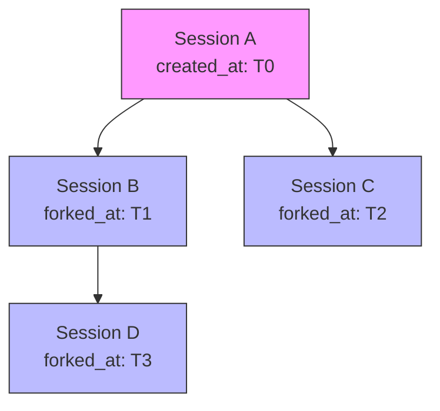

# Session Forking

### From: mod

Session forking enables derivative conversation contexts that inherit state from a parent session while establishing independent evolution paths. The `parent_id: Option<String>` field on `Session` implements this capability, creating a provenance graph where multiple sessions can trace ancestry to common origin points. This concept, borrowed from version control systems like Git's branching model and process management in operating systems, serves critical agent workflows including experimental exploration, alternative strategy comparison, and safe sandboxing of potentially destructive operations.

The implementation stores only the parent reference rather than complete ancestry chains, trading traversal efficiency for storage simplicity—deep lineage queries would require recursive database access or denormalized caching. Forking likely occurs through a dedicated method (not shown in this module) that copies session metadata including directory association and message history, then establishes the parent-child link. The child session receives a fresh UUID and version starting at 1, with `created_at` marking the fork time rather than original conversation inception.

Use cases for session forking include: exploring multiple implementation approaches from a common requirements baseline, creating temporary branches for risky refactoring with easy rollback, comparing agent configurations on identical problem statements, and maintaining stable 'checkpoint' sessions while continuing development. The fork relationship supports UI features like session trees, merge detection for convergent exploration, and impact analysis when parent session context changes. This capability distinguishes sophisticated agent platforms from simple chat interfaces, enabling systematic exploration of complex problem spaces.

## Diagram

## External Resources

- [Git branching model that inspires session forking](https://git-scm.com/book/en/v2/Git-Branching-Branches-in-a-Nutshell) - Git branching model that inspires session forking
- [Process forking in operating systems](https://en.wikipedia.org/wiki/Fork_(system_call)) - Process forking in operating systems

## Related

- [Session Lifecycle Management](session-lifecycle-management.md)

## Sources

- [mod](../sources/mod.md)
