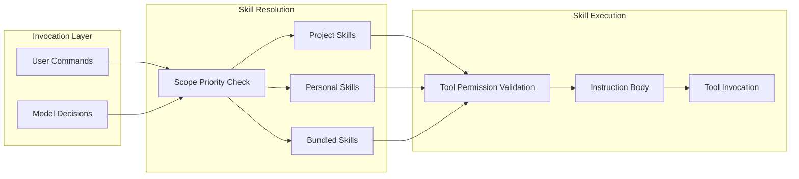

# Skill-Based AI Agent Architecture

### From: bundled

Skill-based architecture represents a fundamental design pattern in modern AI agent systems, where capabilities are decomposed into discrete, composable, and independently deployable units called skills. This approach contrasts with monolithic agent designs by promoting modularity, reusability, and maintainability. In ragent's implementation, each skill encapsulates a specific capability—such as code review, batch refactoring, debugging, or scheduled execution—complete with its own configuration, permissions, and execution logic. The architecture enables dynamic skill discovery, loading, and invocation, allowing the agent's capability set to expand without core system modification.

The skill-based pattern addresses several challenges in AI agent development. Separation of concerns allows different teams or contributors to develop skills independently using domain-specific knowledge. Permission scoping becomes granular, as each skill declares its required tools and access levels, enabling principle of least privilege. Versioning and compatibility management are localized to individual skills rather than affecting entire systems. Testing benefits from isolation, with each skill verifiable independently through unit tests that mock its dependencies. The pattern also supports progressive enhancement, where basic skills can be overridden or wrapped by more sophisticated implementations without breaking existing workflows.

Ragent's realization of this pattern demonstrates sophisticated engineering through its priority-based scoping system, explicit tool permissions, and clear invocation boundaries. The `make_bundled_skill` factory function standardizes skill construction while preserving flexibility. Skill bodies act as instruction templates, separating what a skill does from how it's configured. This declarative approach enables skills to be serialized, transferred, and introspected—supporting use cases like skill marketplaces, automated documentation generation, and AI-assisted skill development. The architecture anticipates future evolution toward skill chaining, where outputs from one skill feed into another, and skill composition, where complex workflows emerge from simple primitives.

## Diagram

## External Resources

- [Modular programming - foundational concept for skill-based architectures](https://en.wikipedia.org/wiki/Modular_programming) - Modular programming - foundational concept for skill-based architectures
- [Capability-based security - informs ragent's tool permission system](https://en.wikipedia.org/wiki/Capability-based_security) - Capability-based security - informs ragent's tool permission system

## Sources

- [bundled](../sources/bundled.md)
