# Skill Framework and Dynamic Capability Loading

### From: lib

The skill framework in ragent represents a modular extensibility mechanism that enables dynamic discovery, loading, and invocation of capabilities without requiring core system modification. Skills encapsulate discrete units of functionality—such as specific code transformations, analysis procedures, or tool integrations—that can be registered with the system and invoked through a standardized interface with argument substitution. This architecture mirrors plugin systems in mature development environments but adapts the pattern for AI agent contexts where skills may include natural language descriptions, example invocations, and schema definitions that help the LLM understand when and how to apply each capability. The `skill` module's responsibilities span the complete lifecycle from filesystem discovery through runtime invocation.

Argument substitution within the skill framework enables flexible parameterization, allowing skills to accept contextual inputs that customize their behavior for specific situations. This might include file paths, code regions, configuration options, or references to other project entities. The framework likely implements validation to ensure substituted arguments meet expected schemas before execution, preventing malformed invocations that could cause errors or security issues. Skill discovery mechanisms may include directory scanning, manifest parsing, and potentially remote fetching from trusted registries, creating an ecosystem where capabilities can be shared and versioned independently from the core agent.

The skill abstraction serves critical architectural purposes by decoupling capability definition from agent implementation, enabling domain-specific extensions without fork maintenance. Development teams can create private skill libraries tailored to their codebase conventions, technology stack, and compliance requirements. The framework's design must handle complex concerns including sandboxing of skill execution, dependency management between skills, and hot-reloading for development workflows. By positioning skills as first-class concepts alongside built-in tools, ragent creates a clear extension point that balances the flexibility of custom code with the safety of structured interfaces, a pattern increasingly common in production AI agent platforms.

## Diagram

```mermaid
flowchart LR
    subgraph Discovery["Skill Discovery"]
        scan["Filesystem Scan"]
        manifest["Manifest Parsing"]
        registry["Skill Registry"]
    end
    
    subgraph Runtime["Skill Invocation"]
        match["Intent Matching"]
        substitute["Argument Substitution"]
        validate["Schema Validation"]
        invoke["Execute Skill"]
    end
    
    subgraph Sources["Skill Sources"]
        builtin["Built-in Skills"]
        local["Local Skills"]
        remote["Remote/Registry"]
    end
    
    Sources --> scan
    scan --> manifest
    manifest --> registry
    registry --> match
    match --> substitute
    substitute --> validate
    validate --> invoke
```

## External Resources

- [OpenAI function calling patterns that skill frameworks often implement](https://platform.openai.com/docs/guides/function-calling) - OpenAI function calling patterns that skill frameworks often implement
- [Microsoft's plugin architecture patterns for reference](https://learn.microsoft.com/en-us/dotnet/core/tutorials/creating-app-with-plugin-support) - Microsoft's plugin architecture patterns for reference

## Sources

- [lib](../sources/lib.md)
