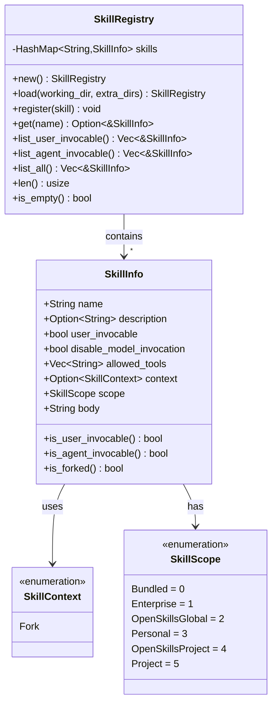

# Skill Registry Pattern

### From: mod

The Skill Registry pattern implements a centralized repository for managing discovered skills with indexed access and query capabilities. The pattern encapsulates skill storage in a HashMap<String, SkillInfo> indexed by skill name, enabling O(1) lookup by identifier. This design separates skill discovery and loading concerns from runtime query operations, creating a clean boundary between initialization and usage phases.

The registry provides specialized query interfaces for different invocation modes: list_user_invocable filters for skills visible to users via /name commands, while list_agent_invocable filters for skills available to the model for automatic invocation. The list_all method returns deterministically sorted results (by name) to ensure consistent output across calls, important for testing and user interface stability. These query methods return borrowed references (&SkillInfo) to avoid unnecessary cloning while maintaining lifetime safety through Rust's borrow checker.

Registry initialization follows a multi-phase loading sequence that respects scope hierarchy: bundled skills register first, then discovered skills from the filesystem overlay with priority-based conflict resolution. This pattern enables dynamic skill ecosystems where components can be added, overridden, or replaced without modifying core registry code. The registry's Default implementation and new constructor both create empty registries, supporting both incremental construction and complete loading workflows. The pattern demonstrates effective use of Rust's ownership system, with methods like get returning Option<&SkillInfo> to handle missing skills gracefully while avoiding panic-prone direct indexing.

## Diagram

## External Resources

- [Martin Fowler's Repository pattern description](https://martinfowler.com/eaaCatalog/repository.html) - Martin Fowler's Repository pattern description
- [Rust HashMap documentation (underlying registry storage)](https://doc.rust-lang.org/std/collections/struct.HashMap.html) - Rust HashMap documentation (underlying registry storage)

## Related

- [Skill Scope Hierarchy](skill-scope-hierarchy.md)

## Sources

- [mod](../sources/mod.md)
