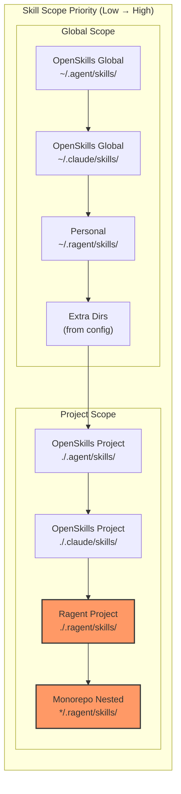

# Skill Scope Hierarchy

### From: loader

The skill scope hierarchy defines a six-tier priority system for skill discovery that determines which skill definition takes precedence when multiple skills share the same name. The hierarchy operates from lowest to highest priority: OpenSkills global (system-wide skills in `~/.agent/` and `~/.claude/`), personal user skills (`~/.ragent/`), extra directories from configuration (treated as personal scope), OpenSkills project-local (`.agent/` and `.claude/` within the working directory), project-specific Ragent skills (`.ragent/skills/`), and finally monorepo nested skills (subdirectories containing `.ragent/skills/`). This design enables powerful customization patterns—users can override globally distributed skills with personal versions, and projects can further specialize with project-local definitions. The `SkillScope` enum in the type system encodes these levels, enabling runtime decisions about precedence and conflict resolution. When `discover_skills()` executes, it accumulates skills in priority order, with later discoveries replacing earlier ones of the same name, ensuring that the most specific configuration always wins.

## Diagram

## External Resources

- [Configuration precedence patterns in software systems](https://en.wikipedia.org/wiki/Configuration_file#Configuration_precedence) - Configuration precedence patterns in software systems

## Sources

- [loader](../sources/loader.md)

### From: mod

The skill scope hierarchy defines a six-level priority system governing how skills are discovered, loaded, and resolved when naming conflicts occur. This hierarchical design enables sophisticated customization while maintaining predictable override semantics. The scope levels range from Bundled (lowest priority, index 0) through Enterprise, OpenSkillsGlobal, Personal, OpenSkillsProject, to Project (highest priority, index 5). This numerical ordering enables straightforward comparison operations using standard integer comparison.

The scope resolution algorithm implemented in SkillRegistry::register applies a dominance rule: a new skill replaces an existing one only if its scope is greater than or equal to the existing skill's scope. This ensures that higher-priority skills always prevail in conflicts, while equal-scope replacements enable updates within the same level. The Project scope specifically represents .ragent/skills/ directory contents and takes precedence over all other levels, enabling complete project-specific customization. Ragent-native paths at equivalent levels (Personal vs OpenSkillsGlobal, Project vs OpenSkillsProject) take precedence over their OpenSkills counterparts, ensuring framework-specific optimizations apply when available.

The scope hierarchy enables practical workflows like enterprise standardization (Enterprise scope for organization-wide defaults), personal productivity libraries (Personal scope for user-specific tools), and project-specific adaptations (Project scope for team conventions). The system's design anticipates multi-tenant and organizational deployment scenarios where different stakeholder needs must be balanced. Loading order in SkillRegistry::load implements this hierarchy explicitly: bundled skills register first at lowest priority, then discovered skills overlay based on their detected scopes, with the register method's dominance check ensuring correct final state.
