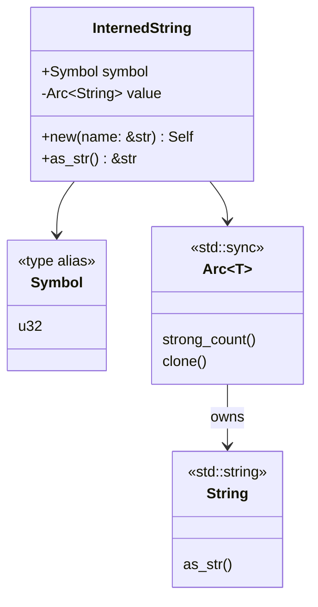

# Smart Pointer Caching

### From: intern

The `InternedString` struct demonstrates sophisticated use of Rust's smart pointer types to optimize access patterns. By caching the resolved string value in an `Arc<String>` alongside the symbol handle, the design eliminates the need to acquire the global mutex lock for every string access operation. This technique exemplifies the copy-on-write and reference-counting patterns that enable efficient data sharing in Rust's ownership system.

The `Arc` (atomic reference-counted) type provides thread-safe shared ownership of the cached string value, allowing cheap cloning of `InternedString` instances without duplicating the underlying string data. When `InternedString::new()` is called, it performs the interning operation once, resolves the symbol to obtain the canonical string, then stores this in the `Arc`. Subsequent calls to `as_str()` simply return a reference to the cached value without any synchronization overhead. This amortizes the cost of the initial mutex acquisition across all future accesses.

The design also anticipates potential serialization needs through serde trait implementations. The `Serialize` implementation delegates to the cached `String` value, producing natural JSON string output. The `Deserialize` implementation reconstructs an `InternedString` by first deserializing to a temporary `String`, then re-interning it. This ensures that deserialized values participate in the interning system, maintaining the memory and performance benefits across serialization boundaries. The round-trip through `InternedString::new()` during deserialization guarantees that any identical strings will share symbols, preserving the deduplication invariant even after data has left and re-entered the system.

## Diagram

## External Resources

- [Rust standard library Arc documentation](https://doc.rust-lang.org/std/sync/struct.Arc.html) - Rust standard library Arc documentation
- [Serde serialization framework documentation](https://serde.rs/) - Serde serialization framework documentation

## Sources

- [intern](../sources/intern.md)
