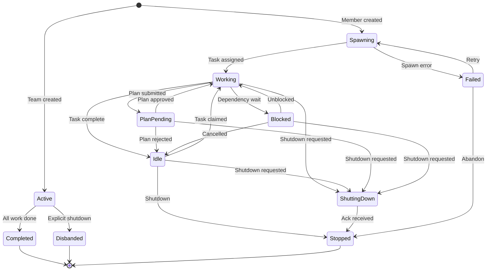

# State Machine Lifecycle

### From: config

State machine lifecycle management is a foundational pattern in ragent that provides explicit modeling of team and member status transitions, enabling robust error handling and operational visibility. The configuration defines multiple state enums—`TeamStatus` for overall team health, `MemberStatus` for individual agent sessions, and `PlanStatus` for approval workflows—each representing a finite set of mutually exclusive states with defined semantics. This approach eliminates ambiguity about system state and enables compile-time exhaustiveness checking when handling state transitions.

`TeamStatus` tracks coarse-grained team health through `Active`, `Completed`, and `Disbanded` states, supporting graceful shutdown sequences and archival workflows. `MemberStatus` provides fine-grained session tracking with eight distinct states covering the full agent lifecycle: `Spawning` for initialization, `Working` and `Idle` for operational states, `PlanPending` for approval workflows, `Blocked` for dependency management, `ShuttingDown` for graceful termination, `Stopped` for completed sessions, and `Failed` for error states with diagnostic information in `last_spawn_error`. This granularity enables precise orchestration decisions and clear operational dashboards.

The `PlanStatus` enum implements a simple approval workflow with `None`, `Pending`, `Approved`, and `Rejected` states, supporting human-in-the-loop governance for high-risk activities. State transitions are typically managed by the lead agent's reconciliation loop, which evaluates current states against desired configurations and issues appropriate commands. The `Default` trait implementations provide sensible initial states (`Active` for teams, `Spawning` for members, `None` for plans), ensuring that deserialized configurations without explicit state fields behave predictably. This state machine architecture is essential for building reliable distributed systems where partial failures and asynchronous operations are common.

## Diagram

## External Resources

- [Finite-state machine theory and applications](https://en.wikipedia.org/wiki/Finite-state_machine) - Finite-state machine theory and applications
- [Rust Default trait for type initialization](https://doc.rust-lang.org/std/default/trait.Default.html) - Rust Default trait for type initialization
- [Exhaustiveness checking in type systems](https://en.wikipedia.org/wiki/Exhaustiveness_checking) - Exhaustiveness checking in type systems

## Sources

- [config](../sources/config.md)
