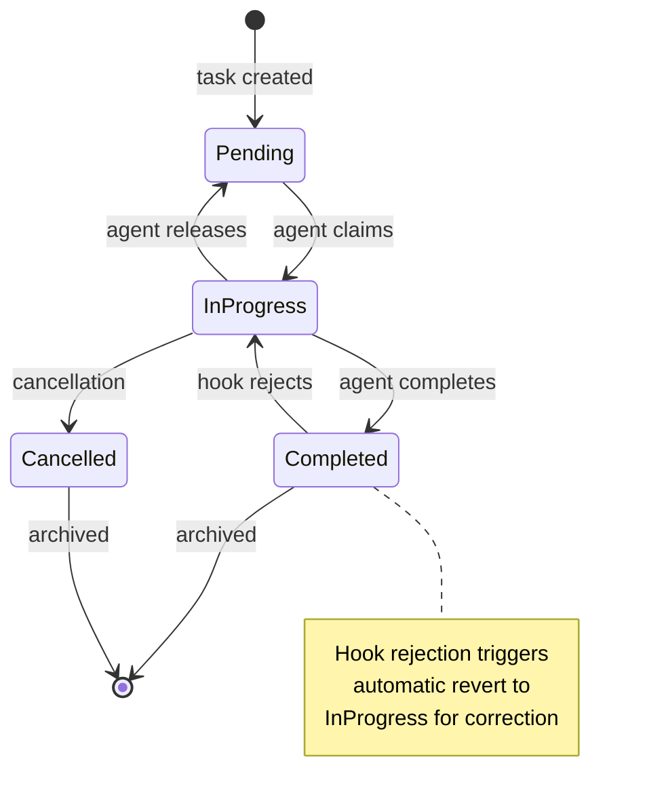

# Stateful Agent Workflows

### From: team_task_complete

Stateful agent workflows represent a paradigm in autonomous AI systems where agents maintain and manipulate persistent state across multiple execution steps, enabling complex multi-turn operations that extend beyond single prompt-response interactions. This source code reveals infrastructure for such workflows through its task state machine, where tasks progress through discrete states (Pending, InProgress, Completed, Cancelled) with defined transitions and persistence guarantees. The statefulness enables agents to coordinate long-running operations, recover from interruptions, and build cumulative context across multiple reasoning steps.

The workflow state machine implemented here exhibits key properties of well-designed stateful systems. States are mutually exclusive and exhaustive, preventing ambiguous conditions. Transitions are controlled—agents cannot arbitrarily set any state but must follow allowed paths, with validation enforcing business rules like assignment requirements for completion. The persistence model through `TaskStore` provides durability, ensuring that agent restarts or crashes don't lose work in progress. This reliability is essential for production deployments where agents may run for extended periods or encounter resource constraints requiring intermittent execution.

The hook mechanism introduces conditional workflow branching based on external validation, creating a dynamic control flow that responds to runtime conditions. This enables sophisticated patterns like human-in-the-loop approvals, where a task completion triggers notification and waits for human judgment before finalizing; quality gates where automated tests must pass; and cascading workflows where completion of one task automatically generates dependent tasks. The revert capability on hook rejection implements compensation patterns from saga-based distributed transaction design, ensuring workflow consistency even when partial operations must be undone.

Stateful workflows contrast with stateless agent patterns where each interaction is independent. While statelessness simplifies scaling and recovery, it limits agents to trivial tasks lacking contextual continuity. This implementation strikes a balance: the agent itself may be stateless (receiving context through `ToolContext`), but the workflow substrate maintains durable state that agents reference and modify. This architecture supports both long-lived autonomous agents that maintain internal memory and ephemeral function-calling patterns where state lives in external systems. The explicit state visibility through structured logging and JSON metadata enables debugging and monitoring of complex workflow executions that would be opaque in purely conversational systems.

## Diagram

## External Resources

- [Finite state machine theory and applications](https://en.wikipedia.org/wiki/Finite-state_machine) - Finite state machine theory and applications
- [Temporal workflow platform for durable execution](https://docs.temporal.io/workflows) - Temporal workflow platform for durable execution
- [Enterprise Integration Patterns for conversation management](https://www.enterpriseintegrationpatterns.com/patterns/conversation/) - Enterprise Integration Patterns for conversation management

## Sources

- [team_task_complete](../sources/team-task-complete.md)
