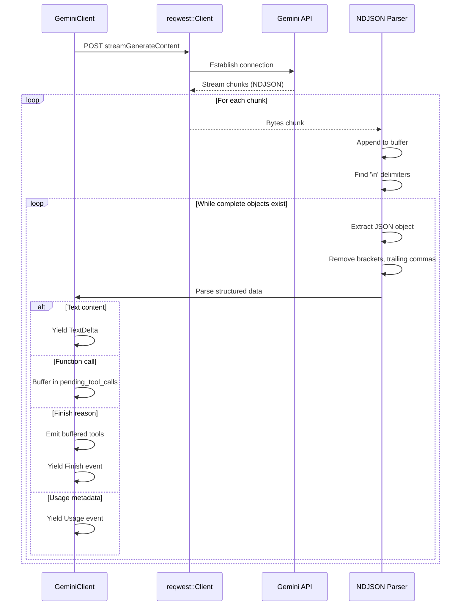

# Streaming Response Processing with NDJSON

### From: gemini

The streaming response implementation in this module addresses the challenge of processing real-time LLM outputs efficiently without blocking or excessive memory allocation. Google's Gemini API employs a variant of newline-delimited JSON (NDJSON) for streaming, where each chunk contains one or more complete JSON objects separated by newlines, optionally wrapped in array brackets with trailing commas. This format differs from traditional Server-Sent Events (SSE) that use `data:` prefixes and `event:` type annotations, requiring custom parsing logic.

The implementation strategy uses a sliding buffer approach combined with asynchronous stream processing. The `bytes_stream` method from `reqwest` yields `Bytes` chunks as they arrive from the network, which are converted to strings and appended to a persistent buffer. The parser then searches for newline delimiters to extract complete JSON objects, handling edge cases like array brackets (`[`, `]`), trailing commas, and empty lines. Incomplete data at chunk boundaries remains in the buffer for concatenation with subsequent chunks, ensuring no data loss across network packet boundaries.

Once parsed, each JSON object undergoes semantic analysis to extract relevant events. The `candidates` array contains the actual generation output, with nested `content` and `parts` structures holding text or function calls. The `usageMetadata` field provides token consumption metrics, while `finishReason` signals completion status. The implementation buffers function calls until completion to ensure atomic emission of tool invocations, as partial function calls would be semantically invalid for downstream consumers. This streaming architecture enables responsive user interfaces that display text as it's generated, while maintaining backpressure through Rust's async stream semantics to prevent memory exhaustion under high-throughput scenarios.

## Diagram

## External Resources

- [NDJSON (Newline Delimited JSON) specification](https://github.com/ndjson/ndjson-spec) - NDJSON (Newline Delimited JSON) specification
- [Server-Sent Events (SSE) web standard](https://developer.mozilla.org/en-US/docs/Web/API/Server-sent_events) - Server-Sent Events (SSE) web standard
- [Futures crate StreamExt trait for async streaming](https://docs.rs/futures/latest/futures/stream/trait.StreamExt.html) - Futures crate StreamExt trait for async streaming

## Sources

- [gemini](../sources/gemini.md)
