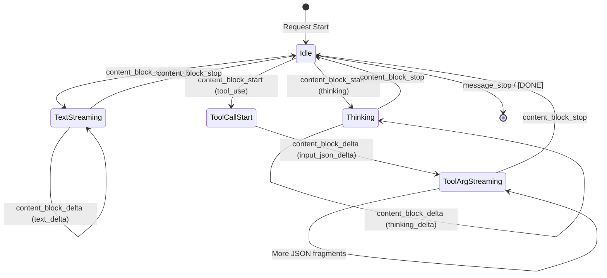

# Streaming Tool Use with JSON Accumulation

### From: anthropic

Tool use (also called function calling) in LLMs enables models to invoke external capabilities, but streaming JSON parsing presents unique challenges when tool arguments arrive incrementally. This implementation demonstrates sophisticated handling of streaming tool calls through the `input_json_delta` event type, where partial JSON strings are accumulated in a `HashMap<String, String>` keyed by tool call ID. The pattern addresses the fundamental tension between streaming's real-time benefits and JSON's requirement for complete, valid structures. By tracking active tool calls and appending partial JSON fragments, the implementation enables applications to display or validate tool arguments as they arrive, while deferring full parsing until the `content_block_stop` event signals completion.

The complexity arises from Anthropic's API design where tool calls are identified by ID and index, but arguments stream as partial JSON strings without explicit boundaries. The code uses a heuristic approach, tracking the most recently started tool call as the likely destination for JSON deltas, which works for the common case of sequential tool execution. This stateful accumulation pattern requires careful memory management—the `tool_call_args` HashMap grows during the stream and is cleaned up when tool calls complete. The implementation yields `ToolCallDelta` events containing both the tool ID and the partial JSON fragment, allowing upstream consumers to implement progressive validation or user feedback. This design enables rich user experiences like showing a loading indicator while tool arguments stream in, or validating arguments against schemas incrementally.

The broader architectural pattern demonstrated here separates the transport-level streaming (SSE events) from the application-level abstraction (`StreamEvent` enum with `ToolCallStart`, `ToolCallDelta`, `ToolCallEnd` variants). This layered approach allows the provider implementation to handle API-specific quirks while presenting a clean, provider-agnostic interface to the rest of the system. The handling of tool use alongside other content types (text, thinking) in the same stream shows how modern LLM outputs are fundamentally multi-modal and interleaved—text explanations may alternate with tool invocations, which may be followed by tool results, all within a single response. The implementation's careful state machine management, with explicit transitions between content block types and proper cleanup on stream termination, represents production-ready patterns for robust tool use integration.

## Diagram

## External Resources

- [Anthropic tool use documentation](https://docs.anthropic.com/en/docs/build-with-claude/tool-use) - Anthropic tool use documentation
- [JSON Lines format for streaming JSON](https://jsonlines.org/) - JSON Lines format for streaming JSON

## Sources

- [anthropic](../sources/anthropic.md)
