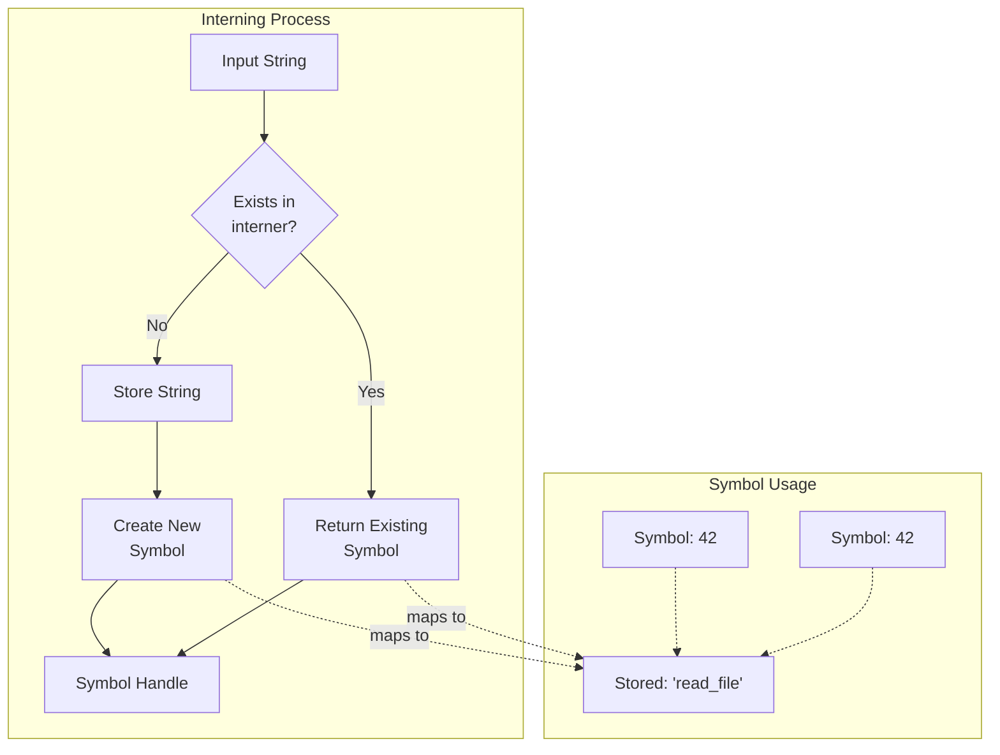

# String Interning

### From: intern

String interning is a fundamental memory optimization technique where each distinct string value is stored exactly once in a centralized location, with all references to that string pointing to the single stored instance. This approach dramatically reduces memory consumption in applications that process large volumes of text with significant redundancy, such as compilers, natural language processing systems, and agent frameworks. The technique transforms expensive string comparisons from O(n) character-by-character operations into O(1) integer or pointer comparisons, yielding substantial performance benefits.

The implementation in this module demonstrates classic interning patterns: a global hash-based store maintains the canonical string instances, while lightweight symbol handles are distributed throughout the application. The `string_interner` crate's `DefaultSymbol` type, which is a type alias for `u32` or similar small integer, serves as this handle. When strings are interned, the system first checks if an identical string already exists; if so, the existing symbol is returned, otherwise the string is stored and a new symbol assigned. This deduplication process happens transparently to callers.

The tradeoffs of interning are important to understand. Memory is never reclaimed from the interner in this implementation, meaning long-running processes with many unique strings could experience unbounded growth. Additionally, every interning operation requires acquiring a mutex lock, creating potential contention points in highly concurrent scenarios. The module mitigates this through the `InternedString` struct's caching of resolved values in an `Arc<String>`, allowing subsequent reads without lock acquisition. Modern systems often employ generational or scoped interners to address the memory retention issue, though the simplicity of a global never-free interner remains attractive for many use cases.

## Diagram

## External Resources

- [Wikipedia article on string interning with historical context](https://en.wikipedia.org/wiki/String_interning) - Wikipedia article on string interning with historical context
- [Java's String.intern() method documentation, showing the technique in another language](https://docs.oracle.com/javase/8/docs/api/java/lang/String.html#intern--) - Java's String.intern() method documentation, showing the technique in another language
- [Rust compiler development guide where interning is heavily used](https://rustc-dev-guide.rust-lang.org/overview.html) - Rust compiler development guide where interning is heavily used

## Sources

- [intern](../sources/intern.md)
