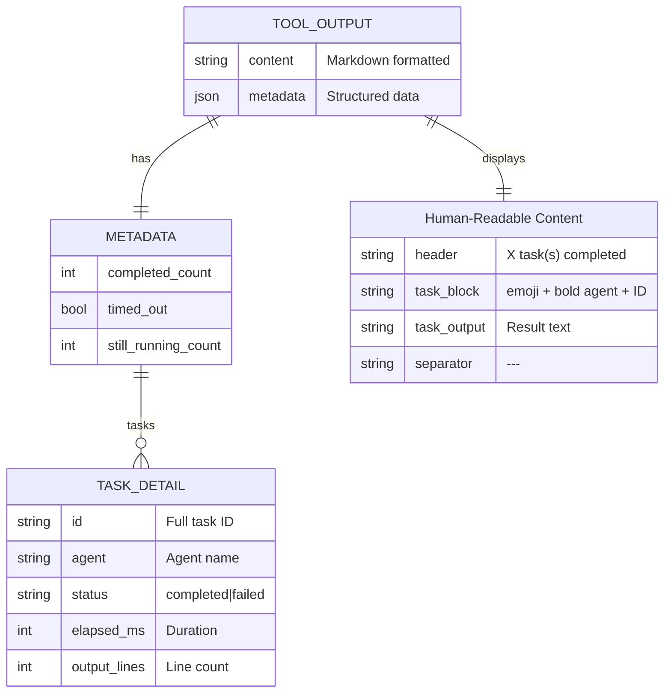

# Structured Output and TUI Integration

### From: wait_tasks

The WaitTasksTool demonstrates sophisticated output formatting that serves both human readability and structured machine consumption, a dual-requirement common in modern developer tools and AI agent interfaces. The `content` field provides a Markdown-formatted string with emoji indicators (✅/❌), bold agent names, truncated task IDs, and horizontal rules for visual separation—optimized for terminal display. Simultaneously, the `metadata` field contains a JSON structure with precise data: completion counts, timeout status, and per-task details including timing in milliseconds and output line counts.

This dual-output pattern enables rich terminal user interfaces (TUIs) that can display the formatted content directly while using structured metadata for interactive features—sortable tables, progress bars, or drill-down views. The `task_details` construction with `elapsed_ms` computed from `signed_duration_since` and `output_lines` from `lines().count()` provides actionable metrics for performance analysis and output sizing. The use of `num_milliseconds` with `as u64` conversion handles the potential negative durations that `signed_duration_since` might produce (though logically shouldn't in this context).

The formatting choices reveal user experience considerations: 8-character task ID truncation balances uniqueness (UUID v4 first 8 chars provide reasonable collision resistance) with readability, agent names are prominently displayed to identify which sub-system completed work, and the timeout warning (⚠️) with still-running task list helps users understand partial results. This output design pattern—human-friendly prose with machine-parseable metadata—has become standard in AI agent frameworks, CLI tools, and API responses, supporting both direct use and programmatic processing.

## Diagram

## External Resources

- [Command Line Interface Guidelines](https://clig.dev/) - Command Line Interface Guidelines
- [Ratatui crate for building terminal user interfaces](https://docs.rs/ratatui/latest/ratatui/) - Ratatui crate for building terminal user interfaces

## Sources

- [wait_tasks](../sources/wait-tasks.md)
