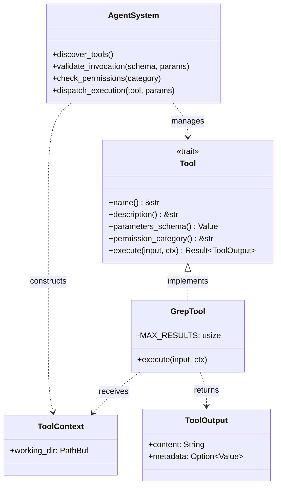

# Structured Tool Interfaces for AI Agents

### From: grep

Structured tool interfaces represent an emerging design pattern for enabling AI agents to safely and effectively invoke external capabilities, moving beyond raw text generation to principled interaction with software systems. The `GrepTool` implementation exemplifies this through its implementation of a `Tool` trait that standardizes discovery, parameter validation, permission checking, and execution across diverse capabilities. This pattern addresses core challenges in agent systems: preventing hallucinated tool invocations, ensuring type-safe parameter passing, enforcing capability-based access control, and providing consistent error handling that agents can reason about.

The interface design in `GrepTool` demonstrates several best practices for agent-facing tools. The `parameters_schema` method returns a JSON Schema-compatible description of all parameters, including types, descriptions, and required fields. This enables automatic validation of agent-generated invocations, clear documentation for model prompting, and in advanced systems, UI generation for human oversight. The schema's rich descriptions—such as noting Rust regex syntax or explaining multiline mode semantics—serve dual purposes of human documentation and model guidance, helping agents construct correct invocations. The `permission_category` method (`"file:read"`) integrates with capability systems that can restrict agent actions based on configured permissions, preventing unauthorized file access even if the agent requests it.

The execution contract balances flexibility with structure. Input arrives as `serde_json::Value` enabling schema-flexible parsing (accommodating model outputs that may have type variations), but is immediately validated and converted to strongly-typed Rust values. Output uses a structured `ToolOutput` type with separate `content` (human/AI-readable text) and `metadata` (machine-structured JSON) fields, serving both presentation and programmatic consumption. Error handling through `anyhow::Result` provides rich context chaining while the `async` signature enables integration into concurrent agent workflows. This architecture anticipates composition scenarios where `GrepTool` results might feed into other tools—search results informing file reading, analysis, or modification operations—requiring both human-parseable explanations and precise structured data for downstream processing.

## Diagram

## External Resources

- [OpenAI documentation on function calling patterns for tool use](https://platform.openai.com/docs/guides/function-calling) - OpenAI documentation on function calling patterns for tool use
- [JSON Schema specification for structured parameter validation](https://json-schema.org/) - JSON Schema specification for structured parameter validation
- [Schemars crate for generating JSON Schema from Rust types](https://docs.rs/schemars/latest/schemars/) - Schemars crate for generating JSON Schema from Rust types

## Sources

- [grep](../sources/grep.md)
