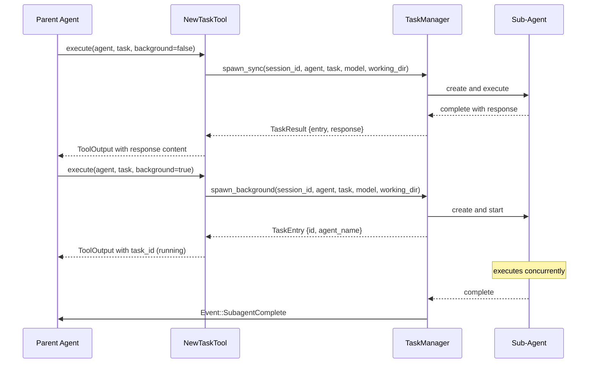

# Sub-Agent Spawning

### From: new_task

Sub-agent spawning is a fundamental architectural pattern in multi-agent systems where a parent agent delegates specialized work to child agents with specific capabilities or focus areas. In this implementation, spawning operates through a structured `TaskManager` abstraction that handles lifecycle management including creation, execution monitoring, and completion notification. The pattern enables hierarchical task decomposition, allowing complex problems to be broken into smaller, focused subtasks handled by agents optimized for particular domains like exploration, building, or planning.

The implementation supports two distinct spawning modes reflecting different coordination requirements. Synchronous spawning (`spawn_sync`) blocks the parent agent until sub-agent completion, appropriate when results are immediately needed for continuation or when serial dependency exists between tasks. Background spawning (`spawn_sync`) enables concurrent execution, with completion signaled through `Event::SubagentComplete` events. This dual-mode design requires callers to explicitly consider concurrency implications—the documentation warns that `background: false` blocks subsequent tool calls, making background mode mandatory when multiple tasks spawn in the same response.

A sophisticated aspect of this spawning implementation is model inheritance, addressing configuration complexity in heterogeneous provider environments. Rather than requiring explicit model specification for every sub-task, the system automatically propagates parent session configuration when no override is provided. This prevents failures when parent sessions use specialized providers (e.g., GitHub Copilot) that differ from sub-agent hardcoded defaults. The inheritance is implemented through `active_model` field access and string formatting to `provider/model` convention, demonstrating careful attention to real-world deployment scenarios where provider consistency matters for API compatibility and billing attribution.

## Diagram

## External Resources

- [LangGraph multi-agent concepts documentation](https://langchain-ai.github.io/langgraph/concepts/multi_agent/) - LangGraph multi-agent concepts documentation
- [AutoGen conversation patterns for multi-agent workflows](https://microsoft.github.io/autogen/docs/tutorial/conversation-patterns/) - AutoGen conversation patterns for multi-agent workflows

## Related

- [Multi-Agent Orchestration](multi-agent-orchestration.md)

## Sources

- [new_task](../sources/new-task.md)
