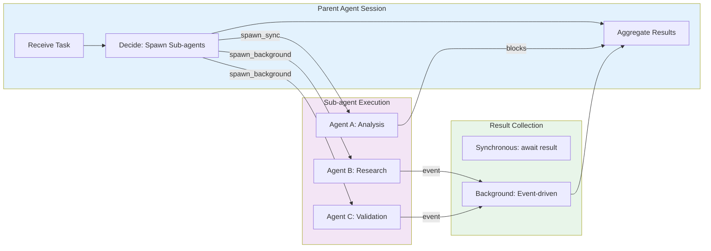

# Sub-agent Task Execution

### From: mod

Sub-agent task execution represents a fundamental pattern in multi-agent AI systems, where a primary agent delegates specialized work to secondary agents with specific capabilities or focuses. The ragent implementation formalizes this pattern through the TaskManager, which handles the complexity of session isolation, resource management, and result aggregation. When a parent session spawns a sub-agent, the system creates a completely isolated child session with its own state, context, and execution environment, preventing side effects from polluting the parent while maintaining hierarchical relationships for debugging and event correlation. This isolation is critical for reliability: a crashing or misbehaving sub-agent cannot corrupt the parent's state, and resource limits can be enforced per sub-agent rather than globally.

The execution model supports two complementary patterns: synchronous spawning for sequential dependency chains where the parent cannot proceed without sub-agent results, and background spawning for parallelizable work where multiple sub-agents can execute simultaneously. The synchronous path blocks the parent's execution thread (in async terms, awaits the completion) and returns a TaskResult with full response text, suitable for decision points requiring sub-agent analysis. The background path returns immediately with a TaskEntry handle, enabling the parent to spawn multiple agents, perform other work, and later collect results through event subscription or polling. This duality supports complex workflow patterns like map-reduce operations, competitive agent ensembles (multiple agents attempting the same task with result voting), and phased pipelines where stages execute in parallel.

Real-world applications include code generation systems where a planner agent spawns specialized agents for architecture design, implementation, and testing; research assistants that dispatch parallel searches across different sources; and creative workflows with separate agents handling drafting, critique, and refinement. The implementation's concurrency limits (default 4 background tasks) reflect practical constraints on API rate limits, token costs, and compute resources, with backpressure through the error path when limits are exceeded. Event-driven result delivery via SubagentComplete events enables loose coupling between task execution and result consumption, supporting patterns like reactive UI updates, persistence to databases, or chaining to additional processing stages without blocking the task manager.

## Diagram

## External Resources

- [Multi-agent systems in AI applications](https://www.deeplearning.ai/the-batch/how-multi-agent-systems-could-enable-more-complex-ai-applications/) - Multi-agent systems in AI applications
- [AutoGen multi-agent conversation framework](https://microsoft.github.io/autogen/) - AutoGen multi-agent conversation framework
- [LangGraph multi-agent concepts](https://langchain-ai.github.io/langgraph/concepts/multi_agent/) - LangGraph multi-agent concepts

## Related

- [Event-Driven Architecture](event-driven-architecture.md)

## Sources

- [mod](../sources/mod.md)
