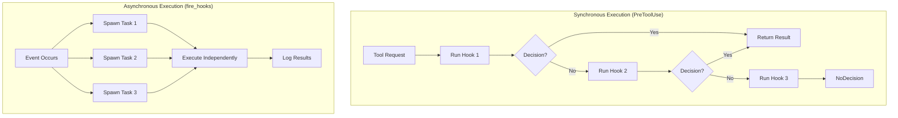

# Synchronous vs Asynchronous Hook Execution

### From: mod

The ragent hooks module implements a sophisticated dual-mode execution strategy that distinguishes between hooks requiring immediate decisions and those performing background processing. Synchronous execution, used exclusively for PreToolUse hooks, blocks the main runtime until a decision is rendered, enabling hooks to modify or veto operations before they occur. This mode uses spawn_blocking to prevent async runtime pollution while maintaining the semantic requirement that tool execution cannot proceed until all relevant hooks have their say. The implementation collects hook results sequentially, returning the first decisive response to short-circuit processing when a clear decision emerges. Conversely, asynchronous execution via fire_hooks and run_post_tool_use_hooks enables fire-and-forget observation patterns where hooks log, notify, or transform results without impeding primary flow. PostToolUse hooks specifically chain modifications, with later hooks seeing earlier transformations, creating a pipeline effect. This bifurcation reflects deep understanding of use case requirements: permission decisions must be immediate and authoritative, while post-hoc analysis benefits from concurrency and loose coupling.

## Diagram

## External Resources

- [Async Rust cookbook on integrating blocking code](https://rust-lang.github.io/async-book/09_recipes/02_external_libraries.html) - Async Rust cookbook on integrating blocking code
- [Classic essay on async/sync color in programming languages](https://journal.stuffwithstuff.com/2015/02/01/what-color-is-your-function/) - Classic essay on async/sync color in programming languages

## Sources

- [mod](../sources/mod.md)
