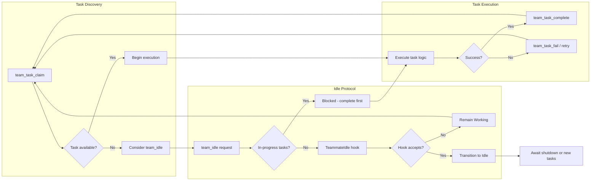

# Task-Claim Coordination Protocols

### From: team_idle

The `TeamIdleTool` exists within a broader protocol ecosystem for distributed task allocation, implementing the 'work completion notification' phase complementary to task claiming and execution phases. The explicit reference in documentation—'Use team_task_claim first to verify no tasks remain before calling this'—reveals a designed coordination protocol where agents follow a standard sequence: claim available work, execute to completion, claim additional work if available, and only then notify idle status. This protocol prevents race conditions where multiple agents might simultaneously believe work remains, or where an agent goes idle while tasks exist due to stale local caches. The protocol represents an instance of the 'claim-check' pattern adapted for autonomous agent systems.

The coordination challenge addressed is fundamental to distributed systems: maintaining consistency between task availability and agent capacity without centralized scheduling bottlenecks. The ragent approach appears decentralized—agents independently assess task availability through `team_task_claim` operations, with `TeamStore` and `TaskStore` providing atomic operations for claim attempts. The idle tool's guard clause against in-progress tasks adds a safety net for protocol violations, where an agent might attempt to claim new work while abandoning previous assignments. This defense-in-depth acknowledges that AI agents, unlike deterministic programs, may produce unexpected behavior patterns or encounter failures that leave task state inconsistent.

The protocol's design implications extend to system behavior under various load conditions. During high-demand periods, the `TeammateIdle` hook enables dynamic load redistribution—rejecting idle requests when queue depth exceeds thresholds, effectively implementing backpressure. During low-demand periods, rapid idle transitions allow resource reclamation or cost optimization in cloud deployments. The summary parameter supports forensic analysis of agent productivity and failure modes, creating audit trails for why agents entered idle states. Future protocol extensions might include: proactive task push from leads to idle agents (reverse of claim pattern), priority-based idle rejection (critical agents remain available), or batch completion protocols for high-throughput scenarios where per-task overhead dominates.

## Diagram

## External Resources

- [AWS patterns for distributed task processing](https://aws.amazon.com/builders-library/avoiding-insurmount-queues/) - AWS patterns for distributed task processing
- [Patterns of Distributed Systems by Martin Fowler](https://martinfowler.com/articles/patterns-of-distributed-systems/) - Patterns of Distributed Systems by Martin Fowler
- [Dynamo: Amazon's highly available key-value store (distributed coordination)](https://www.cs.cornell.edu/home/rvr/papers/OSDI04.pdf) - Dynamo: Amazon's highly available key-value store (distributed coordination)

## Related

- [Agent State Machines in Distributed Systems](agent-state-machines-in-distributed-systems.md)
- [Hook-Based Extensibility Patterns](hook-based-extensibility-patterns.md)

## Sources

- [team_idle](../sources/team-idle.md)
