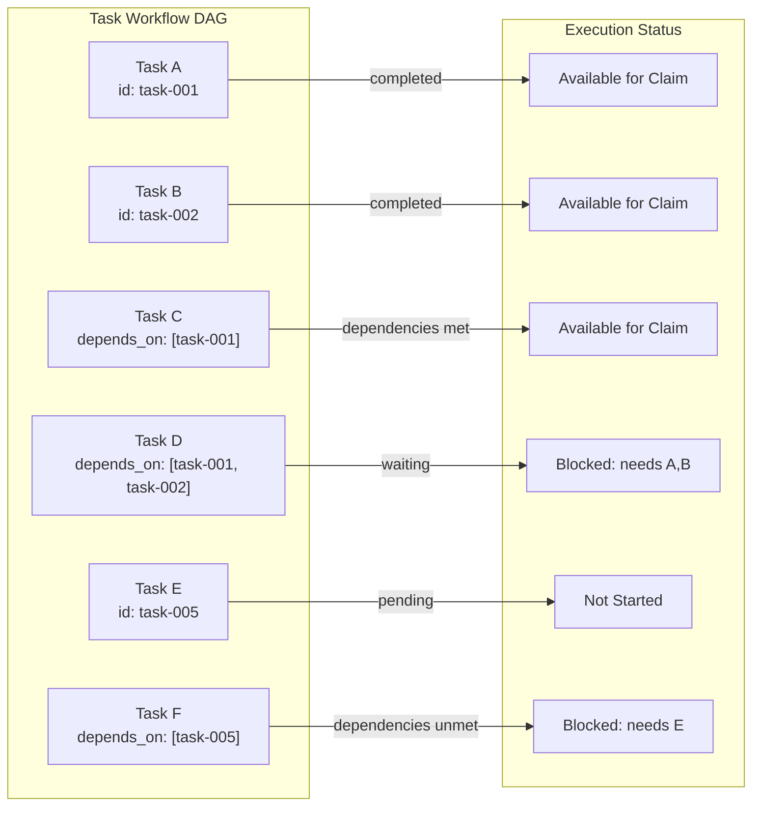

# Task Dependency Management in Agent Workflows

### From: team_task_create

Task dependency management in the TeamTaskCreateTool enables sophisticated workflow orchestration where task execution order respects prerequisite relationships. The depends_on parameter accepts an array of task IDs that must complete before the created task becomes claimable, implementing a partial ordering constraint essential for complex multi-step agent workflows. This mechanism prevents premature task execution that might waste resources or produce inconsistent states when prerequisite work is incomplete.

The dependency model appears to be explicit and static—dependencies are declared at creation time rather than discovered dynamically. This design choice favors predictability and debuggability over flexibility, making workflow structures inspectable and verifiable. The string-based task ID references create loose coupling between dependent tasks, allowing tasks to reference prerequisites that may not yet exist (supporting forward declaration) or that may be in different states of completion. The implementation collects valid string dependencies into a Vec<String>, filtering out non-string values gracefully rather than failing validation, suggesting defensive programming for robustness in face of imperfect input.

Dependency management interacts with the broader task lifecycle through the team_task_claim tool mentioned in documentation. A task with unresolved dependencies presumably remains unclaimable or is filtered from available task lists, creating natural workflow blocking without explicit synchronization primitives. This pattern enables agent pool scaling where workers can claim available tasks while dependency-constrained tasks wait for prerequisite completion. The approach resembles dataflow programming models where computation graphs execute as dependencies resolve, adapted to agent-centric execution where task agents rather than function calls comprise the computational units.

## Diagram

## External Resources

- [Directed acyclic graph (DAG) - foundation for dependency modeling](https://en.wikipedia.org/wiki/Directed_acyclic_graph) - Directed acyclic graph (DAG) - foundation for dependency modeling
- [Apache Airflow DAG concepts (industrial workflow dependency system)](https://airflow.apache.org/docs/apache-airflow/stable/concepts/dags.html) - Apache Airflow DAG concepts (industrial workflow dependency system)
- [DryadLINQ: distributed execution with DAG dependencies (research background)](https://www.cs.cmu.edu/~dga/papers/napper-sosp2003.pdf) - DryadLINQ: distributed execution with DAG dependencies (research background)

## Related

- [Multi-Agent Coordination](multi-agent-coordination.md)

## Sources

- [team_task_create](../sources/team-task-create.md)
